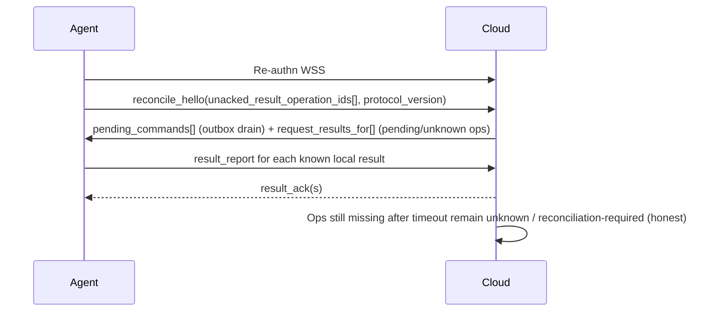

# TinyAdmin V1 Agent↔Cloud Protocol

**Status:** Proposed — Security **re-review required** after SEC-PR12-001..003 remediation (CRITICAL); Independent Code Review **not** requested until Security clears BLOCKING items  
**Governing issue:** [#3](https://github.com/balarajeai/tinyadmin/issues/3)  
**ADR:** [0007-agent-cloud-protocol-wss.md](./adr/0007-agent-cloud-protocol-wss.md)  
**Constrains:** [ADR 0006](./adr/0006-cloud-agent-security-properties.md), [v1-system-architecture.md](./v1-system-architecture.md) §2.4 / §3.4–§3.5 / §5.6.1  
**Product lock:** [docs/product/v1-requirements.md](../product/v1-requirements.md)

This document does **not** claim Security approval, production readiness, or Issue #6 schema finality. It selects the V1 communication mechanism and maps it to approved properties.

---

## 1. Decision summary

| Layer | V1 choice |
| --- | --- |
| Session transport | Agent-initiated **WebSocket over TLS (`wss://`)** |
| Bootstrap / durable fallback | **HTTPS** enrollment + result/reconciliation POST |
| Agent identity | Per-Agent **Ed25519** keypair; Cloud stores public key only |
| Cloud command authenticity | Cloud **signed authorization envelopes** on commands |
| Delivery | Commands & results **at-least-once**; mutation **effects** exactly-once via `operation_id` idempotency |
| Addressing | Cloud never dials customer hosts; commands target `agent_id` already connected or waiting in Cloud outbox |
| Customer DB ports | **Not required** to be public; Cloud never opens 5432/27017 to customers |

Hard rules preserved: no customer DB credentials in Cloud; one Agent ↔ one org + one env; §3.5 mutation bindings enforced; result delivery not best-effort.

---

## 2. ADR 0006 property mapping (mandatory)

| Property | Mechanism in this protocol |
| --- | --- |
| **P-OUTBOUND** | Agent dials `wss://` / `https://` only; no inbound Agent control port; no Cloud→DB |
| **P-ENCRYPT** | TLS on WSS and HTTPS |
| **P-AGENT-ID** | Unique `agent_id` with enrolled Ed25519 public key; challenge–response on session open; revoke disables authn |
| **P-CMD-AUTH** | Cloud-signed command envelopes; Agent verifies with Cloud command-signing public key |
| **P-REPLAY** | Unique `operation_id` + Agent dedupe store + envelope `exp`; duplicates → idempotent prior result |
| **P-ORG-BIND** | Enrollment and envelopes bind `organization_id`; Agent rejects mismatch vs local binding |
| **P-ENV-BIND** | Enrollment and envelopes bind `environment_id`; Agent rejects mismatch |

Additional §5.6.1 mapping: durable Agent result store + retry until authenticated Cloud `result_ack`; Cloud lifecycle `pending` / `succeeded` / `failed` / `unknown`; reconciliation on reconnect.

**SEC-PR12-001:** Mutating Cloud signature covers envelope fields **including** `mutation_payload_sha256` (SHA-256 of RFC 8785 JCS canonical mutation payload). See §6.1.

**SEC-PR12-002:** Delivered-but-unexecuted mutates are cancelable; pre-exec validity check; short-lived envelope TTL class; see §9.

**SEC-PR12-003:** Unqualified “exactly-once effects” removed; execution state machine §6.2 / failure modes §10.

---

## 3. Alternatives evaluation (summary)

Full comparison lives in ADR 0007. Short form:

- **WSS + signed envelopes + HTTPS fallback** — selected (ops fit Contabo/nginx, Spring/Go, push latency, no broker).
- **HTTPS poll-only** — rejected as sole channel (latency/load); kept as fallback.
- **gRPC streaming** — rejected for V1 proxy/ops cost.
- **MQTT/broker** — rejected (extra infra / unjustified service).
- **mTLS-only** — rejected as sole design (ops + still need app authz binding).
- **Inbound Agent** — rejected (outbound-only violation).

---

## 4. Identity lifecycle

### 4.1 Enrollment / registration

```mermaid
sequenceDiagram
  participant Admin as Org admin (UI)
  participant Cloud as Cloud agentcontrol
  participant Audit as Cloud audit
  participant Agent as Customer Agent
  Admin->>Cloud: Create enrollment (org, env)
  Cloud->>Cloud: Allocate agent_id; bind org+env immutable
  Cloud->>Audit: enrollment_created
  Cloud-->>Admin: one-time enrollment token (short TTL)
  Note over Admin,Agent: Token + Cloud URL configured on Agent host (customer-side)
  Agent->>Agent: Generate Ed25519 keypair; store private key locally
  Agent->>Cloud: HTTPS Activate(enrollment_token, public_key, agent metadata)
  Cloud->>Cloud: Verify token; store public_key; activate; invalidate token
  Cloud->>Audit: agent_activated
  Cloud-->>Agent: agent_id, org, env, cloud_command_signing_pubkey, protocol_version
```

### 4.2 Credential storage

| Secret | Where stored | Notes |
| --- | --- | --- |
| Agent private key | Customer-side only (file/secret manager) | Never sent to Cloud after activation |
| Enrollment token | Ephemeral; Cloud hashed/stored until use or expiry | Single use |
| Customer DB credentials | Customer-side only | Unrelated to Agent↔Cloud auth material |
| Cloud command-signing private key | Cloud KMS/secret store | Public key to Agents at enrollment |
| Session capability | Memory / short-lived Agent store | Not a mutation authorization |

### 4.3 Rotation

1. Agent generates new keypair.
2. Agent authenticates with current key over HTTPS/WSS and submits **rotation request** signed by old key, including new public key.
3. Cloud stores new public key, audits, optionally keeps old key overlap window ≤ N minutes for in-flight sessions, then retires old key.
4. DB secrets unaffected (SR-AGENT-ROT-01).

### 4.4 Revocation

1. Cloud marks Agent `revoked`, audits, invalidates sessions.
2. Outbox mutating commands for that `agent_id` → **cancelled** (must not execute).
3. Subsequent WSS/HTTPS authn fails (SR-AGENT-AUTH-03 / SR-AGENT-ROT-02).
4. Agent MUST wipe or cease using local session material on authn failure after revoke (best effort; Cloud enforce is authoritative).

---

## 5. Connection lifecycle (session)

```mermaid
sequenceDiagram
  participant Agent
  participant Cloud
  Agent->>Cloud: TCP+TLS to Cloud; HTTP Upgrade WebSocket
  Cloud-->>Agent: TLS server auth (Cloud cert)
  Agent->>Cloud: session_hello(agent_id, protocol_version)
  Cloud->>Agent: challenge(nonce)
  Agent->>Cloud: challenge_response(signature by Agent private key)
  Cloud->>Cloud: verify pubkey; check not revoked; bind org/env
  Cloud-->>Agent: session_ok(session_exp, server_time)
  loop Heartbeat
    Agent->>Cloud: ping / heartbeat
    Cloud-->>Agent: pong
  end
  Note over Agent,Cloud: Idle timeouts: Agent refreshes session before exp; reconnect with full challenge
```

**Reconnect / backoff (normative expectations):**

- Exponential backoff with jitter after disconnect: start ~1s, cap ~60s.
- On reconnect: re-authn; **drain Cloud outbox**; **resend unacked results**; reconcile `pending`/`unknown` operations (§7).
- Proxy idle timeout: Agent sends heartbeats at ≤ 30s (configurable below proxy limits).

---

## 6. Command delivery flow

Cloud addresses an Agent **only** via its authenticated outbound session or by enqueuing to that `agent_id`’s outbox (no inbound customer port).

```mermaid
sequenceDiagram
  participant Act as Cloud actions
  participant OB as Cloud outbox (PostgreSQL)
  participant WS as Cloud WSS session
  participant Agent
  Act->>Act: Confirm gate passed; build canonical mutation payload; mint signed envelope incl. mutation_payload_sha256
  Act->>OB: Insert command (pending_dispatch) keyed by operation_id + agent_id
  alt Agent online
    OB->>WS: Push command frame
    WS->>Agent: command + signed envelope + mutation payload
    Agent->>Agent: Verify kid/sig; recompute digest; match bindings/exp; load execution state
  else Agent offline
    Note over OB: Wait for reconnect; enforce outbox TTL/depth; envelope exp still short-lived
  end
```

**Command frame (logical fields — domain persistence may be Issue #6):**

- `message_type`: `command`
- `command_type`: `discover` \| `search` \| `preview` \| `execute` \| `rollback` \| …
- `authorization`: signed envelope (fields in §6.1)
- `payload`: structured mutation/read body (**never** arbitrary SQL/Mongo text)
- `protocol_version`

### 6.1 Signed mutation payload integrity (SEC-PR12-001) — V1 chooses digest binding

**Approach:** Option **B** — Cloud signature covers authorization envelope fields including **`mutation_payload_sha256`**.

1. Cloud builds **canonical mutation payload** object with **exactly** these keys (RFC **8785 JCS**, UTF-8):
   - `action_or_field_op` — `{ "type":"action", "action_definition_id":"…" }` **or** `{ "type":"approved_field", "approved_field_edit_config_id":"…" }` (rollback: `{ "type":"rollback", "parent_operation_id":"…" }`)
   - `targets` — structured record selector(s) / identifiers authorized for this operation
   - `parameters` — requested values / Action parameters
   - `max_affected_records` — integer upper bound authorized for this execution
2. `mutation_payload_sha256` = SHA-256 over the JCS bytes of that object (hex lowercase encoding in envelope field).
3. **Envelope fields signed by Cloud** (JCS of envelope body excluding `signature`), minimum:
   - `kid`, `operation_id`, `actor_id`, `organization_id`, `environment_id`, `agent_id`, `connection_id`
   - `action_or_field_op` (same identity as payload)
   - `mutation_payload_sha256`, `max_affected_records`
   - `iat`, `exp`
   - `signature` (Ed25519 over the envelope canonical bytes)
4. Agent **MUST**:
   - reject unknown `kid`
   - verify Cloud signature
   - recompute digest from received `payload` via the same JCS rules
   - verify digest matches envelope; verify `action_or_field_op` / org/env/agent/connection/`max_affected_records` consistency
   - **fail closed** on malformed canonical form or mismatch
   - **never** execute a payload not covered by verified authorization
5. Coverage/canonicalization are **normative Security properties** — not deferred open items. Codec libraries may vary; **rules above are frozen for V1**.

### 6.2 Agent operation execution state machine (SEC-PR12-003)

Normative Agent-local states for mutating `operation_id` (persist durably where noted):

| State | Meaning | Durable? |
| --- | --- | --- |
| `received` | Command accepted into Agent work queue | recommended |
| `authorized` | Envelope+payload integrity checks passed | recommended |
| `execution_intent_persisted` | Agent durable store records intent to mutate **before** attempting DB mutation where feasible | **MUST** attempt before mutate |
| `executing` | Mutation attempt in progress | best-effort |
| `succeeded` | Terminal success known locally | **MUST** |
| `failed` | Terminal failure known locally (incl. reject-before-mutate) | **MUST** |
| `unknown` / `reconciliation_required` | Outcome indeterminate (e.g. DB may have committed; local completion incomplete) | **MUST** |

**Rules:**

- Before mutate: transition to `execution_intent_persisted` when feasible; if cannot persist intent, **fail closed** (do not mutate).
- **Never** blindly re-execute when prior state is `executing` or `unknown`.
- Duplicate command after `succeeded`/`failed`: return prior outcome; no second mutate.
- Duplicate command after `unknown`: do not mutate again; report `unknown` / drive reconciliation.
- Cloud must not invent terminal success without durable correlated result (§5.6.1).

**Crash behavior:**

| Window | Behavior |
| --- | --- |
| Before `execution_intent_persisted` | Safe to treat as not executed; may authorize again only with valid non-canceled/non-expired envelope |
| After intent persisted, before DB mutate | On restart: do not assume success; if envelope still valid and not canceled, may proceed once; else fail/cancel |
| During execution / DB commit unclear | Mark `unknown`; reconcile — **no blind retry mutate** |
| DB commit succeeded, Agent crashes before local `succeeded` | `unknown` until reconciliation proves outcome (engine-specific: Postgres/Mongo strategies) |
| Mutation succeeded, local completion persistence fails | Prefer retry **completion persistence** / result report; if outcome unclear → `unknown` |
| Restart before Cloud ack | Resend durable result; wait for authenticated `result_ack` |
| Duplicate command after restart | Honor state machine above |

PostgreSQL vs MongoDB reconciliation probes are **engine-specific** and must not assume a universal exactly-once cross-store protocol.

**Expiry / TTL:** Agent rejects `exp` outside validity (with clock-skew policy §11). Cloud outbox retention TTL ≠ authorization execute authority (short-lived envelope class).

---

## 7. Execution-result acknowledgment / retry

```mermaid
sequenceDiagram
  participant Agent
  participant Local as Agent durable result store
  participant Cloud
  participant Op as Cloud operation lifecycle
  Agent->>Agent: Execute or reject after checks
  Agent->>Local: Persist result(operation_id, status, body) until ack
  Agent->>Cloud: result_report(operation_id, …) via WSS (or HTTPS fallback)
  Cloud->>Op: Correlate; transition pending→succeeded/failed/unknown; idempotent if duplicate
  Cloud->>Cloud: Append audit terminal (or unknown path)
  Cloud-->>Agent: authenticated result_ack(operation_id) (SEC-PR12-005)
  Agent->>Local: Delete or mark acked only after authenticated ack
  Note over Agent,Cloud: Ignore unauthenticated acks; retry until authenticated ack; never drop mutate result silently
```

**HTTPS fallback:** `POST /agent/v1/results` with Agent signature over body, same rules — required so result delivery is not stranded on WS-only failures.

**`result_ack` authenticity (SEC-PR12-005):** Cloud acknowledgments **MUST** be authenticated (Cloud-signed or equivalently bound to the authenticated Cloud session) and include `operation_id`. Agent **MUST** ignore unauthenticated acks.

**Abandon policy:** Only after Cloud marks operation `unknown`/`failed` with audited reason **and** Security/ops policy allows stopping Agent retries (e.g. retention exceeded). Default V1: Agent retains mutate results ≥ **7 days** or until ack.

---

## 8. Reconnect / reconciliation flow



Cloud **MUST NOT** invent `succeeded`/`failed` when intent exists without durable terminal result.

---

## 9. Revocation / cancel of delivered-but-unexecuted mutates (SEC-PR12-002)

```mermaid
sequenceDiagram
  participant Admin
  participant Cloud
  participant OB as Outbox
  participant Agent
  Admin->>Cloud: Revoke agent_id / Action / authz
  Cloud->>Cloud: Mark revoked; terminate Agent sessions where applicable
  Cloud->>OB: Cancel matching outbox mutates
  Cloud->>Agent: cancel(operation_ids[]) when session exists
  Agent->>Agent: Record cancel/revoke; drop expired; do not execute canceled ops
  Note over Agent: Before every mutate: re-check cancel set, envelope exp, session validity
  Note over Agent,Cloud: Already-committed customer DB mutations are not reversed by revoke
```

### Normative Agent/Cloud rules

1. Cloud revoke/disable of Agent **MUST** terminate active Agent sessions where Cloud can signal/kill them.
2. Agent **MUST** track revocation and per-`operation_id` cancellation state (durable recommended).
3. Mutating commands **already delivered** but **not yet executed** **MUST** be cancelable; Agent **MUST NOT** execute after relevant Agent/Action/auth revocation or cancel is known.
4. Agent **MUST** check command validity **immediately before** execution (signature still valid only if not expired; not canceled; session/authz still acceptable per policy).
5. On **reconnect**, Agent **MUST** re-establish current authorization/session state, pull/process cancels, and only then consider pending mutates.
6. **Expired** authorization envelopes **MUST** be discarded (not executed).
7. **Canceled** `operation_id` **MUST NOT** be executed.
8. **Envelope TTL policy class:** mutating authorization is **short-lived** (minutes-scale class). Outbox may retain commands longer for delivery attempts, but execute authority ends at `exp`. Exact minutes are Platform/Security tunable; V1 must not rely on long-lived offline execute authority.
9. **Cancel vs execute race:** if Agent already entered `executing` / DB commit path, revoke cannot reliably stop it; if commit occurred → report `succeeded` (or `unknown` if indeterminate). Revoke **does not** reverse committed mutations.
10. **Residual window (honest):** between last successful cancel delivery and a mutate that begins with a still-unexpired envelope while Cloud has revoked but Agent has not yet learned cancel/session kill — residual risk remains; mitigate with short `exp`, session kill, and pre-exec checks. Do not claim zero residual race.

Also: permission/Action revoke cancels matching Cloud-outbox and Agent-delivered mutates for that scope (SR-QUEUE-REAUTH).

---

## 10. Failure-mode table

| Failure | Expected behavior |
| --- | --- |
| Agent offline | Commands sit in outbox until TTL/depth; UX shows Agent unhealthy; mutates fail closed at depth/TTL |
| WS disconnect mid-command | Command remains unacked in outbox or Agent may have started work — reconcile via `operation_id`; no silent success |
| DB mutate succeeded, Cloud miss | Agent retries result until ack; Cloud stays `pending`/`unknown` until result |
| Cloud crash after Agent mutate | Same — durable Agent result + reconcile on reconnect |
| Duplicate command delivery | Honor execution state machine (§6.2); no blind second mutate |
| Duplicate result delivery | Cloud idempotent apply by `operation_id` |
| Expired envelope | Agent rejects; Cloud marks failed (not executed) |
| Org/env/connection mismatch | Agent rejects; audit failure |
| Revoke while queued | Cancel queue; no mutate |
| Revoke after mutate before ack | Result may become ops `unknown` if Agent cannot authn to deliver; honest state |
| Replay attack | Signature + payload digest + `operation_id` state + `exp` |
| Revoke after delivery, before execute | Cancel + pre-exec check; must not execute (§9) |
| DB commit then Agent crash | `unknown` + reconcile; no unqualified exactly-once claim (§6.2) |
| Rogue Cloud (TLS MITM without pin) | TLS + optional cert pin; envelopes still need Cloud signing key — Agent must ship trusted Cloud signing pubkey from enrollment |
| Poisoned queue depth | Fail closed on new mutates; alert |
| Partial multi-step Action | Status reflects partial/failed; audit honest (Action definition concern; protocol carries status enum) |
| Protocol version skew | Session negotiate; incompatible → refuse with clear error; see §12 |

---

## 11. Ordering, backpressure, observability, keys, time (SEC-PR12-004/006/008)

| Topic | V1 rule |
| --- | --- |
| Ordering | Best-effort FIFO per Agent; no global order across connections |
| Backpressure | Soft warn threshold (e.g. 70% depth); hard fail-closed at max depth |
| Metrics (Cloud) | Connected Agents; outbox depth; command age; result lag; authn failures; reject reasons; cancel counts |
| Metrics (Agent) | Connected; unacked results; pending mutates; cancel set size; last heartbeat |
| Logs | No enrollment tokens, private keys, DB passwords, raw session secrets (SR-LOG-NOSECRET) |
| Tracing | Propagate `operation_id` in frames and logs |
| Signing `kid` | Required on envelopes; Agent rejects unknown `kid`; rotation uses overlap accept-set then retire old |
| Clock skew | Bounded tolerance for `iat`/`exp` checks; outside bound → **fail closed**; configured bound documented in ops |
| Agent private key | Platform-appropriate protected storage (restricted secret file/OS keystore/HSM) |
| Algorithms | Ed25519 frozen for V1; envelope `protocol_version` / version field enables future agility |
| Cert pinning | Optional unless Security later requires |

---

## 12. Versioning and upgrade

1. `protocol_version` integer on session hello and messages (start at `1`).
2. Cloud advertises `min_supported` / `max_supported`.
3. Agent refuses to operate if outside range (fail closed).
4. Additive fields allowed in minor evolutions behind version bump when breaking.
5. Agent binary upgrades are customer-side; Cloud must keep at least one prior version during rollout windows.
6. Enrollment always uses current Cloud HTTPS API version path (`/agent/v1/...`).

---

## 13. Implementation acceptance criteria (Architect → implementers / CR)

- [ ] Agent initiates only outbound `wss://` / `https://` to Cloud; no inbound Agent control port required
- [ ] Customer DB ports need not be public; Cloud never dials customer 5432/27017
- [ ] TLS required on all Agent↔Cloud application data
- [ ] Per-Agent Ed25519 identity; enrollment one-time token; public key only in Cloud
- [ ] Challenge–response session authn; revoked Agents cannot session
- [ ] Cloud-signed envelopes on mutating commands with §3.5 minimum fields; Agent verifies and rejects bad/expired/mismatched
- [ ] Sensitive reads carry org/env/agent/connection (+ SHOULD signed read grant)
- [ ] At-least-once command delivery; execution state machine persisted; no blind re-mutate when indeterminate; `unknown` + reconciliation when required (SEC-PR12-003)
- [ ] Mutating envelope includes `mutation_payload_sha256` over JCS canonical payload; Agent verifies digest+signature and fail-closes on mismatch (SEC-PR12-001)
- [ ] Delivered-but-unexecuted mutates cancelable; pre-exec validity; short-lived envelope TTL class; reconnect revalidates before execute (SEC-PR12-002)
- [ ] `kid` required; unknown key rejected; authenticated `result_ack`; bounded clock-skew fail-closed (SEC-PR12-004/005/006)
- [ ] Results durable on Agent; retry until Cloud `result_ack`; HTTPS result fallback exists
- [ ] Cloud operation lifecycle includes pending/succeeded/failed/unknown; no silent terminalization
- [ ] Reconnect drains outbox and reconciles results
- [ ] Outbox depth + TTL; cancel on revoke; fail closed on overflow for mutates
- [ ] Rotation and revocation audited; DB secrets never in Cloud
- [ ] Protocol version negotiation fail-closed
- [ ] Conformance table to ADR 0006 P-* covered in tests (with Security/QA)
- [ ] No new microservice/broker introduced for V1 protocol

---

## 14. Open questions / residual risks

| Item | Owner | Notes |
| --- | --- | --- |
| Envelope byte layout libraries | Backend/Agent | **Coverage + JCS + SHA-256 rules frozen** (SEC-PR12-001); library choice only |
| Cloud signing key storage (file vs KMS) | Platform + Security | V1 may start with sealed file on Contabo with rotation runbook |
| Cert pinning vs public CA for Cloud TLS | Security + Platform | Document customer options |
| Numeric TTL/depth defaults | CoS/Platform may tune | Properties mandatory; numbers defaults |
| `FA-CONN-BLAST` multi-connection residual | Security / Founder | Unchanged by this ADR |
| Preview read-grant SHOULD vs MUST | Security | Architecture SHOULD; Security may tighten in #5 |
| Result retention 7d default | Security/CoS | Confirm or adjust |
| Domain tables for outbox/keys/dedupe | #6 | Do not invent full schema here |

---

## 15. Handoffs

### Security Engineer
- Review ADR 0007 + this doc for CRITICAL protocol/authn (SR-XPORT-*, SR-CMD-*, SR-REPLAY, SR-AGENT-*, SR-QUEUE-*, SR-IDEM-*).
- Confirm P-* mapping adequacy; list residual risks / Founder FAs if any.
- Do not treat this as overall product security approval.

### Backend (Cloud)
- Implement enrollment HTTPS, WSS gateway in modular monolith `agentcontrol`, outbox in PostgreSQL, envelope signing, lifecycle states, result ack idempotency.
- Respect confirm-before-mint gate from Issue #2 architecture.

### Agent implementation (Go)
- Keygen/storage, WSS client, verify Cloud envelopes, idempotency DB, durable results, HTTPS fallback, backoff, reject mismatched bindings.

### QA
- Cases: offline queue, revoke mid-queue, duplicate command/result, expired envelope, reconnect reconcile, TLS failure, version skew, no public DB ports needed.

### Platform / SRE
- nginx (or equiv) WebSocket upgrade + idle timeouts; TLS certs; no production provisioning in this pre-impl phase — document intended config only.

### Domain modeling (#6)
- Persist Agent public keys, outbox, operation lifecycle, Agent dedupe retention metadata — **owned by #6**, constrained by this protocol.

### Chief of Staff
- Track Security then Code Review gates; do not start Sprint 1 on protocol impl until gates allow; do not close #3 on Architect draft alone.

---

## 16. Security remediation map (PR #12)

| ID | Severity | Response |
| --- | --- | --- |
| SEC-PR12-001 | BLOCKING HIGH | §6.1 digest binding (SHA-256 + RFC 8785 JCS); signature covers envelope incl. payload hash; Agent fail-closed |
| SEC-PR12-002 | BLOCKING HIGH | §9 cancel/revoke for delivered-but-unexecuted; pre-exec checks; short-lived envelope TTL class; residual race honest |
| SEC-PR12-003 | BLOCKING HIGH | Removed unqualified exactly-once effects; §6.2 state machine + crash table; `unknown` + reconcile |
| SEC-PR12-004 | NON-BLOCKING HIGH | `kid` + unknown-key reject + rotation overlap (§11) |
| SEC-PR12-005 | NON-BLOCKING HIGH | Authenticated `result_ack` (§7) |
| SEC-PR12-006 | NON-BLOCKING MEDIUM | Bounded clock-skew fail-closed (§11) |
| SEC-PR12-007 | — | Left for Issue #5 (not resolved here) |
| SEC-PR12-008 | NON-BLOCKING MEDIUM | Protected key storage; Ed25519 V1 freeze; pinning optional (§11) |

ADR 0006 P-* properties preserved (outbound-only, TLS, Agent identity, org/env binding, durable results, unknown semantics).

---

## Document history

| Date | Change |
| --- | --- |
| 2026-09-19 | Initial Issue #3 protocol selection + flows |
| 2026-09-19 | Security remediation SEC-PR12-001..003 (+004/005/006/008 clarifications) |
