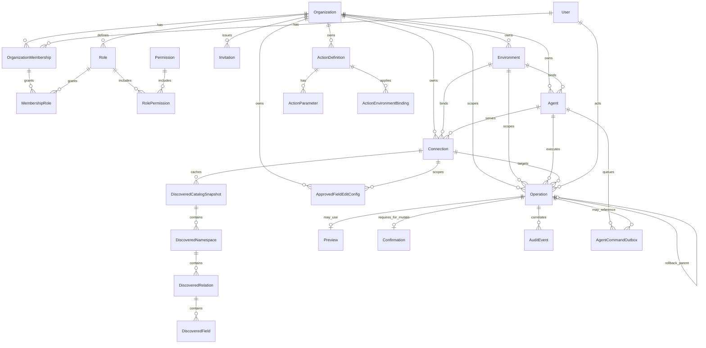

# TinyAdmin V1 Domain Model Outline

**Status:** Proposed — **Security review** (isolation invariants) + **Independent Code Review** required (HIGH)  
**Governing issue:** [#6](https://github.com/balarajeai/tinyadmin/issues/6)  
**Product lock:** [docs/product/v1-requirements.md](../../product/v1-requirements.md)  
**Architecture:** [v1-system-architecture.md](../v1-system-architecture.md) (Issue #2, merged)  
**Date:** 2026-09-19

This document defines the **Cloud control-plane domain** (TinyAdmin’s own PostgreSQL). It does **not**:

- choose Agent↔Cloud wire protocol (Issue **#3**)
- replace the Security threat model / SRs (Issues **#4** / **#5**)
- create migrations, ORM mappings, or application code
- model customer database internals as TinyAdmin Cloud tables

Where a field or mechanism depends on an unresolved #3/#4/#5 decision, it is marked **`DEPENDS-#N`**.

---

## 1. Scope and non-goals

### In scope
Conceptual entities, relationships, cardinality, ownership, invariants, lifecycle enums, uniqueness/index intent, retention/deletion, Safe Action vs approved-field models, Operation/Preview/Audit/Rollback models, Backend/QA handoffs.

### Explicit non-goals
- Final Flyway/Liquibase migrations or SQL DDL freeze
- Pixel-perfect UI information architecture
- Universal PostgreSQL+MongoDB query AST
- Protocol codecs, WSS framing, envelope encoding (**#3**)
- Final threat mitigations / SR numbering ownership (**#4/#5**)
- Billing, SSO IdP config (SSO-ready hooks only)

### Two databases (do not conflate)

| Store | Engine | Contents |
| --- | --- | --- |
| **TinyAdmin Cloud DB** | PostgreSQL | Orgs, users, RBAC, environments, Agents (metadata + public keys), connection **metadata**, Action defs, operations, audit, outbox pointers |
| **Customer DB** | PostgreSQL **or** MongoDB | Customer business data; accessed **only** by customer-side Agent |

Cloud **MUST NOT** store customer DB passwords or raw connection secrets.

---

## 2. Entity catalog (Cloud control plane)

IDs are opaque UUIDs unless noted. Timestamps are `timestamptz`. Soft-delete is called out per entity; audit is never soft-deleted by ops users.

### 2.1 Identity / tenancy

#### Organization
| Field | Notes |
| --- | --- |
| `id` | PK |
| `name`, `slug` | `slug` unique globally |
| `status` | `active` \| `suspended` \| `deleted` |
| `created_at`, `updated_at` | |

#### User
| Field | Notes |
| --- | --- |
| `id` | PK |
| `email` | unique, normalized |
| `password_credential_ref` | hash/KDF material — **not** plaintext; storage detail Backend |
| `status` | `active` \| `disabled` \| `deleted` |
| `created_at`, `updated_at` | |

Users **MAY** belong to many Organizations via membership.

#### OrganizationMembership
| Field | Notes |
| --- | --- |
| `id` | PK |
| `organization_id` | FK → Organization, **required** |
| `user_id` | FK → User, **required** |
| `status` | `active` \| `revoked` |
| `created_at`, `updated_at` | |
| **Unique** | `(organization_id, user_id)` |

#### Role
| Field | Notes |
| --- | --- |
| `id` | PK |
| `organization_id` | FK; org-scoped roles (V1) |
| `key` | e.g. `owner`, `admin`, `operator`, `viewer` — unique per org |
| `name` | display |
| **Unique** | `(organization_id, key)` |

#### Permission
| Field | Notes |
| --- | --- |
| `id` | PK |
| `key` | stable string, e.g. `action.define`, `action.run`, `connection.manage`, `agent.enroll`, `audit.read` |
| `description` | |

V1 may ship a **system permission catalog** (global rows) assigned to roles; org-custom permissions deferred unless product requires.

#### RolePermission
| Field | Notes |
| --- | --- |
| `role_id`, `permission_id` | composite PK |
| **Cardinality** | Role * ↔ * Permission |

#### MembershipRole
| Field | Notes |
| --- | --- |
| `membership_id`, `role_id` | composite PK |
| Constraint | `role.organization_id` MUST equal `membership.organization_id` |

#### Invitation
| Field | Notes |
| --- | --- |
| `id` | PK |
| `organization_id` | FK |
| `email` | invitee |
| `role_ids[]` or join table | intended roles |
| `token_hash` | one-time; raw token never stored |
| `expires_at`, `accepted_at`, `revoked_at` | |
| `invited_by_user_id` | FK → User |
| `status` | `pending` \| `accepted` \| `expired` \| `revoked` |

#### Session (Cloud human auth)
| Field | Notes |
| --- | --- |
| `id` | PK |
| `user_id` | FK |
| `created_at`, `expires_at`, `revoked_at` | |
| `ip_hash` / `user_agent_hash` | optional; no secrets in clear logs |
| **Authz note** | Active org context is **server-side** (membership), never “client sent org id = authz” |

Password-reset tokens: similar one-time hash pattern; omit full table if Backend uses standard pattern — domain requires hashed, expiring, single-use tokens.

**Define vs run (architecture §3.6):** permissions MUST distinguish at least `action.define` / `field_edit.define` vs `action.run` / `field_edit.run` (exact keys Backend may refine with Security #5).

---

### 2.2 Environments

#### Environment
| Field | Notes |
| --- | --- |
| `id` | PK |
| `organization_id` | FK, **immutable** after create |
| `key` | `production` \| `staging` \| future keys; unique per org |
| `display_name` | |
| `kind` | `production` \| `non_production` — drives UX distinguishability |
| `status` | `active` \| `archived` |
| **Unique** | `(organization_id, key)` |

**Invariant:** Environment belongs to exactly one Organization. Production vs non-production MUST remain visually/operationally distinguishable in API/UX (architecture CR-PR10-005).

---

### 2.3 Agent (metadata; protocol details DEPENDS-#3)

#### Agent
| Field | Notes |
| --- | --- |
| `id` | PK (= `agent_id`) |
| `organization_id` | FK, **immutable** |
| `environment_id` | FK, **immutable**; MUST belong to same org |
| `display_name` | |
| `status` | `pending_enrollment` \| `active` \| `disabled` \| `revoked` |
| `public_key_material` | **DEPENDS-#3** encoding (e.g. Ed25519 pubkey bytes); Cloud stores **public** material only |
| `activated_at`, `revoked_at`, `last_seen_at` | |
| `protocol_version_max` | optional negotiated hint; **DEPENDS-#3** |
| **Unique** | none beyond PK; optional unique `(organization_id, environment_id, display_name)` |

#### AgentEnrollmentIntent
| Field | Notes |
| --- | --- |
| `id` | PK |
| `organization_id`, `environment_id` | immutable bind target |
| `agent_id` | preallocated or assigned on activate — pick one in Backend; recommend preallocate |
| `token_hash` | one-time enrollment token |
| `expires_at`, `consumed_at`, `created_by_user_id` | |
| `status` | `pending` \| `consumed` \| `expired` \| `cancelled` |

**Do not model** wire challenge frames here (**#3**). Domain only persists identity binding + public key + lifecycle.

#### AgentCommandOutbox (control-plane queue pointer)
| Field | Notes |
| --- | --- |
| `id` | PK |
| `organization_id`, `environment_id`, `agent_id` | denormalized for isolation filters |
| `operation_id` | FK/logical → Operation when mutate; nullable for pure discover? Prefer always link Operation for mutates |
| `command_type` | `discover` \| `search` \| `preview` \| `execute` \| `rollback` \| … |
| `status` | `queued` \| `dispatched` \| `cancelled` \| `expired` |
| `expires_at` | TTL |
| `payload_ref` / `envelope_ref` | **DEPENDS-#3** storage of signed envelope blob |
| `created_at`, `updated_at` | |
| **Index** | `(agent_id, status, created_at)` |

Depth/TTL policy numbers **DEPENDS-#3** defaults; domain supports cancellation on revoke.

---

### 2.4 Database connections (metadata only)

#### Connection
| Field | Notes |
| --- | --- |
| `id` | PK |
| `organization_id` | FK, **immutable** |
| `environment_id` | FK, **immutable**, same org |
| `agent_id` | FK → Agent; **MUST** match org+env |
| `name` | display |
| `db_engine` | `postgresql` \| `mongodb` |
| `metadata` | JSON **non-secret**: host label optional?, logical DB/name hints, SSL required flag, etc. — **never password, never private URI with embedded secrets** |
| `customer_secret_ref` | opaque label the **Agent** understands locally (e.g. env var name) — not a Cloud secret |
| `status` | `pending_secret` \| `ready` \| `unhealthy` \| `disabled` \| `retired` |
| `created_at`, `updated_at` | |
| **Unique** | `(organization_id, environment_id, name)` recommended |

**Hard constraint:** no customer DB password/raw credential columns in Cloud.

---

### 2.5 Schema discovery (Cloud cache of non-secret metadata)

Discovery results are **Agent-sourced caches**, not source of truth for customer DDL.

#### DiscoveredCatalogSnapshot
| Field | Notes |
| --- | --- |
| `id` | PK |
| `connection_id` | FK |
| `organization_id`, `environment_id` | denormalized |
| `discovered_at` | |
| `agent_id` | who produced |
| `status` | `current` \| `stale` \| `failed` |
| `error_summary` | non-sensitive |

#### DiscoveredNamespace
(schema for Postgres; database/collection namespace for Mongo — **engine-specific**)
| Field | Notes |
| --- | --- |
| `id` | PK |
| `snapshot_id` | FK |
| `engine` | mirrors connection |
| `name` | e.g. Postgres schema name; Mongo DB name |
| **No** unified “query plan” entity |

#### DiscoveredRelation
(table **or** collection — discriminated)
| Field | Notes |
| --- | --- |
| `id` | PK |
| `namespace_id` | FK |
| `kind` | `table` \| `collection` |
| `name` | |
| `engine_specific` | JSON for extras (e.g. Postgres OID hint — optional) |

#### DiscoveredField
| Field | Notes |
| --- | --- |
| `id` | PK |
| `relation_id` | FK |
| `name` | |
| `data_type_label` | engine-native type string (not a forced common type system) |
| `is_nullable` | where applicable |
| `is_identifier_part` | PK/identity hint where known |
| `engine_specific` | JSON |

**Invariant:** No entity representing “user-authored arbitrary SQL/Mongo text” as an executable Cloud operation.

---

### 2.6 Safe Actions

#### ActionDefinition
| Field | Notes |
| --- | --- |
| `id` | PK |
| `organization_id` | FK |
| `key` | unique per org |
| `name`, `description` | |
| `status` | `draft` \| `enabled` \| `disabled` \| `retired` |
| `requires_confirmation` | bool (V1 default true for mutates) |
| `production_extra_confirm` | bool — product/Security (**DEPENDS-#5** exact UX) |
| `max_affected_records` | int limit |
| `rollback_policy` | `none` \| `conditional` — never “unconditional snapshot restore” |
| `created_by`, `updated_at` | |
| **Unique** | `(organization_id, key)` |

#### ActionEnvironmentBinding
| Field | Notes |
| --- | --- |
| `action_definition_id`, `environment_id` | which envs Action may run in |
| Constraint | same `organization_id` |

#### ActionConnectionBinding (optional V1)
Restrict Action to specific connections; if omitted, runtime still requires explicit connection on Operation.

#### ActionParameter
| Field | Notes |
| --- | --- |
| `id` | PK |
| `action_definition_id` | FK |
| `key`, `label` | |
| `value_type` | constrained enum (`string`, `int`, `uuid`, …) — **not** free SQL |
| `required` | bool |

#### ActionStep / ActionEffect (implementation sketch)
Backend may store structured effect descriptors (e.g. update fields where predicate). Domain rule: effects are **allowlisted structured ops**, never raw query text. Exact effect schema can evolve under Backend + Security without becoming a query console.

#### ActionPermission (authorization)
Prefer RBAC permissions + optional per-Action grants:

#### ActionGrant
| Field | Notes |
| --- | --- |
| `action_definition_id` | FK |
| `role_id` **or** `membership_id` | who may **run** |
| `effect` | `allow` |

Define authority remains separate permission (`action.define`).

---

### 2.7 Approved-field editing

#### ApprovedFieldEditConfig
| Field | Notes |
| --- | --- |
| `id` | PK |
| `organization_id` | FK |
| `connection_id` | FK |
| `relation_ref` | FK → DiscoveredRelation **or** stable engine+namespace+name triple |
| `field_ref` | FK → DiscoveredField **or** name |
| `status` | `enabled` \| `disabled` |
| `requires_confirmation` | bool |
| `max_records_per_op` | |
| **Unique** | `(connection_id, relation_ref, field_ref)` |

**Invariant:** Users cannot edit arbitrary fields merely because discovery listed them — only configured rows.

Runtime uses same Operation/Preview/Audit machinery as Actions where applicable (architecture + Security).

---

### 2.8 Operation / preview / confirmation / execution

#### Operation
Central mutate/read-orchestration record for correlation (`operation_id`).

| Field | Notes |
| --- | --- |
| `id` | PK = `operation_id` |
| `organization_id` | FK, required |
| `environment_id` | FK, required |
| `agent_id` | FK, required for Agent-backed ops |
| `connection_id` | FK, required for DB-backed ops |
| `actor_user_id` | FK → User |
| `kind` | `action_execute` \| `field_edit` \| `rollback` \| `preview` \| `discover` \| `search` |
| `action_definition_id` | nullable |
| `approved_field_edit_config_id` | nullable |
| `target` | JSON structured target identifiers (record keys) — not SQL |
| `parameters` | JSON constrained |
| `lifecycle_status` | see §5 |
| `preview_id` | nullable FK → Preview |
| `confirmation_id` | nullable FK → Confirmation |
| `parent_operation_id` | for rollback → original execute |
| `created_at`, `updated_at`, `terminal_at` | |
| **Index** | `(organization_id, environment_id, created_at)`; `(lifecycle_status, updated_at)`; unique `id` |

#### Preview
| Field | Notes |
| --- | --- |
| `id` | PK |
| `operation_id` | optional link / or preview creates child execute later |
| `organization_id`, `environment_id`, `agent_id`, `connection_id`, `actor_user_id` | |
| `kind` | mirrors action/field_edit |
| `requested_at` | |
| `expected_affected_count` | nullable |
| `expected_affected_summary` | JSON non-authoritative |
| `limitation_flags` | e.g. `non_authoritative`, `partial`, `stale_risk` |
| `staleness_hint` | optional |
| `status` | `succeeded` \| `failed` |
| **Rule** | Preview **MUST NOT** imply guaranteed final execute state |

#### Confirmation
| Field | Notes |
| --- | --- |
| `id` | PK |
| `operation_id` | FK — created at confirm gate **before** minting authz binding |
| `actor_user_id` | |
| `confirmed_at` | |
| `acknowledged_limitation_flags` | copy of flags shown |
| `production_ack` | bool/token for prod extra confirm — **DEPENDS-#5** |
| **Rule** | No mutating outbox/envelope without Confirmation for mutate kinds (architecture CR-PR10-004) |

#### AuthorizationBindingRecord (Cloud evidence of minted ticket)
| Field | Notes |
| --- | --- |
| `id` | PK |
| `operation_id` | FK |
| `envelope_fingerprint` / `envelope_blob` | **DEPENDS-#3** |
| `exp` | |
| `created_at` | |
| Fields mirrored: actor, org, env, agent, connection, action/field identity | for audit/forensics |

---

### 2.9 Audit

#### AuditEvent
Append-oriented. **Domain rule:** no UPDATE/DELETE APIs for normal operators.

| Field | Notes |
| --- | --- |
| `id` | PK (monotonic ULID/UUID) |
| `organization_id`, `environment_id` | |
| `actor_user_id` | nullable for system |
| `agent_id`, `connection_id` | nullable |
| `operation_id` | correlation |
| `event_type` | e.g. `operation.intent`, `operation.terminal`, `preview.completed`, `agent.revoked`, `enrollment.created`, … |
| `action_definition_id` / `approved_field_edit_config_id` | nullable |
| `target` | JSON |
| `before_state`, `after_state` | JSON; redaction rules **DEPENDS-#5** |
| `result_status` | includes `unknown` / `reconciliation_required` honestly |
| `rollback_of_operation_id` | nullable |
| `occurred_at` | |
| `security_context` | JSON: request id, permission keys used — no secrets |

**Retention:** default minimum **1 year**. Deletion/archival only via controlled Platform/Security procedure — not ops UI.

**Immutability:** Domain **requires append-only semantics**. Storage-level enforcement (DB grants, triggers, WORM) is an **implementation + Security** requirement from architecture; this outline does **not** claim that enforcement is already technically established in production. Backend MUST implement a concrete append-only strategy before Go-live (`DEPENDS-#4/#5` acceptance).

---

### 2.10 Rollback

Rollback is a **new Operation** (`kind=rollback`) with its own Confirmation, AuthorizationBinding, Agent execution, and AuditEvents, linked via `parent_operation_id`.

#### RollbackEligibility (derived / stored)
| Field | Notes |
| --- | --- |
| `source_operation_id` | original mutate |
| `eligible` | bool |
| `reason` | if not eligible |
| `snapshot_fingerprint` | Agent/Cloud recorded preimage hash or structured before_state reference |
| `checked_at` | |

**Rules:**

- Offered only if ActionDefinition.`rollback_policy=conditional` **and** eligibility checks pass (state unchanged unsafely).
- Never “restore arbitrary snapshot unconditionally.”
- Separately authorized (`action.rollback` or equivalent) and always audited.

---

## 3. Relationship / cardinality diagram

---

## 4. Tenant / environment ownership matrix

| Entity | Owning org | Environment? | Authz boundary |
| --- | --- | --- | --- |
| Organization | self | — | Founder/ops outside tenant |
| User | global identity | — | Authn; tenant via membership |
| OrganizationMembership | org | — | org admin |
| Role / Permission grants | org | — | org admin |
| Invitation | org | — | org admin |
| Environment | org | self | org admin |
| Agent | org | **exactly one** | enroll/revoke roles |
| Connection | org | **exactly one** | connection.manage |
| Discovery cache | org | via connection | read with connection access |
| ActionDefinition | org | via bindings | action.define / action.run |
| ApprovedFieldEditConfig | org | via connection.env | field_edit.define / run |
| Operation / Preview / Confirmation | org | **required** | run permissions |
| AuditEvent | org | usually set | audit.read; **no** mutate for ops |
| Outbox | org | required | system + agentcontrol |

**Cross-tenant:** ordinary application flows MUST NOT create relationships across `organization_id` values. Server derives org from session membership, **never** from client-supplied org id as authorization (SEC-PR10-007).

---

## 5. Lifecycle / status definitions

### Operation.lifecycle_status (normative)
| Status | Meaning |
| --- | --- |
| `pending` | Confirm accepted and/or binding issued; awaiting durable terminal result |
| `succeeded` | Terminal success durably known |
| `failed` | Terminal failure durably known (including reject-before-mutate) |
| `unknown` / `reconciliation_required` | Intent exists; terminal result not durably known — **MUST NOT** silently coerce to success/failure |

Transport retry/ack mechanics **DEPENDS-#3**; statuses are domain-mandatory (architecture §5.6.1).

### Agent.status
`pending_enrollment` → `active` → (`disabled` \| `revoked`). Revoked is terminal for that agent_id (re-enroll = new agent_id or Security-reviewed procedure **DEPENDS-#4/#5**).

### Connection.status
`pending_secret` → `ready` ↔ `unhealthy` → `disabled`/`retired`. Org/env/agent_id **immutable**; retire+recreate to change.

---

## 6. Domain invariants (normative)

1. A User MAY belong to multiple Organizations.
2. Every tenant-owned resource belongs to **exactly one** Organization.
3. An Environment belongs to exactly one Organization.
4. A V1 Agent belongs to exactly one Organization **and** exactly one Environment (immutable).
5. A Connection belongs to exactly one Organization **and** exactly one Environment (immutable).
6. A Connection’s Agent MUST have the **same** Organization and Environment.
7. Cloud stores **no** customer DB passwords or raw DB credentials.
8. Production and non-production resources MUST NOT silently cross (Agent/Connection/Operation/Action bindings).
9. DB-backed Operations are scoped to Organization + Environment + Agent + Connection.
10. AuditEvents preserve `operation_id` correlation for mutate attempts; unknown terminals recorded honestly.
11. Safe Actions and approved-field edits MUST NOT become arbitrary SQL/Mongo consoles.
12. Rollback is conditional, separately authorized, audited, and linked to the original Operation.
13. Client-supplied organization id is never authorization.
14. Mutating Operations require Confirmation before authorization-binding mint/dispatch.
15. Module/data model MUST allow `connections` to store `agent_id` without depending on protocol module internals (architecture CR-PR10-001).

---

## 7. Important uniqueness / index requirements

| Area | Requirement |
| --- | --- |
| User.email | UNIQUE |
| Organization.slug | UNIQUE |
| Membership | UNIQUE (org, user) |
| Role | UNIQUE (org, key) |
| Environment | UNIQUE (org, key) |
| ActionDefinition | UNIQUE (org, key) |
| Connection | UNIQUE (org, env, name) recommended |
| Operation.id | UNIQUE (correlation key) |
| AuditEvent | PK; INDEX (org, occurred_at); INDEX (operation_id) |
| Outbox | INDEX (agent_id, status, created_at) |
| Invitation.token_hash | UNIQUE |

FK indexes on all `organization_id` / `environment_id` filter columns used in queries.

---

## 8. Retention / deletion considerations

| Data | Retention / deletion |
| --- | --- |
| AuditEvent | ≥ **1 year** default; no ops delete/update |
| Operation / Preview / Confirmation | retain ≥ audit needs; align with 1 year minimum for mutate-related rows |
| Outbox | TTL short (days); cancelled/expired rows purgeable after audit intent recorded |
| Enrollment tokens | purge after consume/expiry |
| Sessions | expire; revoke on logout/password change |
| Discovery snapshots | replaceable; keep last N or TTL — non-authoritative |
| Soft-deleted org resources | tombstone; hard delete only via controlled procedure |

---

## 9. Security-sensitive domain rules

- Tenant isolation on every tenant-owned table (`organization_id` NOT NULL where applicable).
- Environment isolation columns on Agent, Connection, Operation, Outbox, Audit (when env-scoped).
- Secret redaction in Audit before/after (**DEPENDS-#5**).
- Agent public keys only in Cloud; private keys never persisted in Cloud (**DEPENDS-#3** material format).
- Permission split define vs run.
- Production `kind` drives extra confirmation flags (**DEPENDS-#5**).
- Append-only audit semantics; enforcement strategy before production (**DEPENDS-#4/#5**, Backend).

---

## 10. Open questions / dependencies

| ID | Question | Owner |
| --- | --- | --- |
| D-3-1 | Exact Agent public key / envelope / outbox payload codec and retention numbers | **#3** |
| D-3-2 | Whether discover/search always create Operation rows vs lighter command records | **#3** + Backend (recommend yes for correlation) |
| D-4-1 | Final threat mitigations affecting enrollment rebind procedures | **#4** |
| D-5-1 | Exact permission keys, production step-up, preview audit mandatory in prod | **#5** |
| D-5-2 | Audit redaction field catalog | **#5** |
| D-6-1 | Action effect DSL shape (structured updates) detail level for V1 MVP | Architect/Backend spike post-gates |
| D-F-1 | Default env keys beyond production/staging | Founder if needed |

Do **not** treat open PR #12 (#3) or in-flight #4 as settled inside this document.

---

## 11. Backend implementation handoff

1. Implement Cloud PostgreSQL schema from this catalog without storing customer DB secrets.
2. Enforce immutability of org/env on Agent/Connection in application + DB constraints.
3. Enforce Agent↔Connection org/env match with CHECK/trigger or equivalent.
4. Implement Operation lifecycle including `unknown` / `reconciliation_required`.
5. Implement Confirmation-before-outbox for mutates.
6. Implement append-only AuditEvent write path; deny updates/deletes for app roles.
7. Keep Postgres vs Mongo discovery metadata discriminated (`kind` / `engine_specific`), no common query language.
8. Wait for **#3** before freezing envelope/outbox blob columns; use opaque `BYTEA`/`JSONB` stubs if sequencing requires.
9. Align permission keys with **#5** when published.
10. No microservices for these aggregates — modular monolith modules from Issue #2.

---

## 12. QA verification handoff

- Multi-org user membership works; cross-org resource access denied.
- Client spoofed `organization_id` cannot authorize.
- Agent cannot be bound to two envs; Connection rejects mismatched Agent env.
- Enabled Action run vs define permission matrix.
- Unconfigured field cannot be edited.
- Preview flags flow into Confirmation record.
- Operation stuck without result stays `pending`/`unknown`, never silent success.
- Rollback creates new Operation + audit link; ineligible rollback not offered.
- Audit ops user cannot UPDATE/DELETE events (API + DB role tests).
- No password columns in Cloud connection tables (schema review).

---

## 13. Document history

| Date | Change |
| --- | --- |
| 2026-09-19 | Initial Issue #6 domain model outline |
