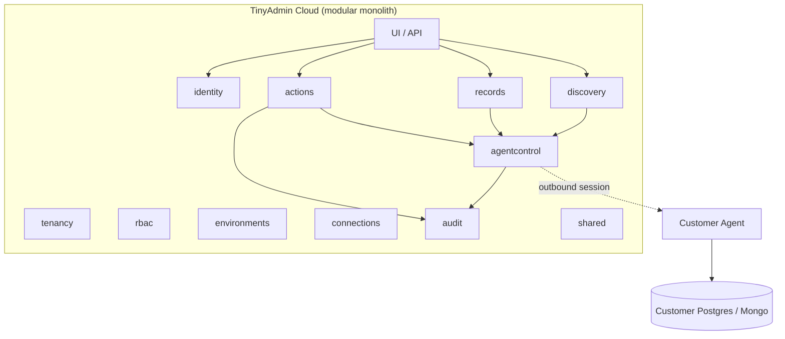
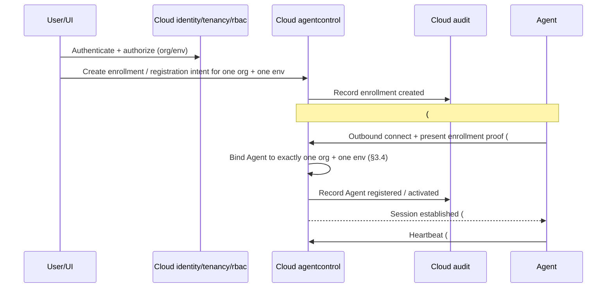
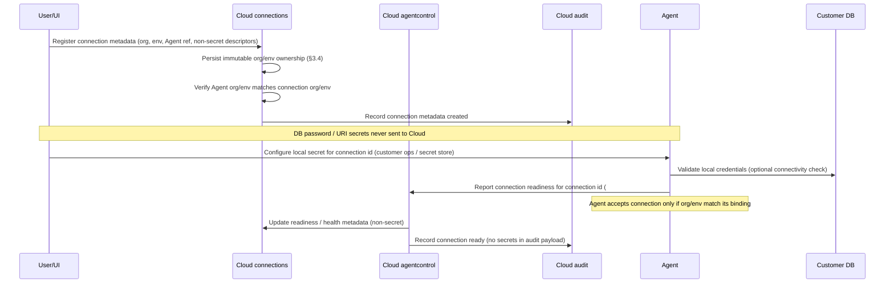

# TinyAdmin V1 System Architecture

**Status:** Proposed for Security re-review + Code Review (Issue #2)  
**Governing issue:** [#2](https://github.com/balarajeai/tinyadmin/issues/2)  
**Product lock:** [docs/product/v1-requirements.md](../product/v1-requirements.md)  
**ADRs:** [adr/](./adr/)  
**Date:** 2026-09-18  
**Security remediation:** 2026-09-19 — addresses `SEC-PR10-001` … `SEC-PR10-004` (and architecture-level NON-BLOCKING clarifications)

This document does **not** claim Security approval. It supplies design inputs for Security (#4/#5) and Code Review.

---

## 1. Summary

TinyAdmin V1 is a **Cloud control plane** (modular monolith) plus a **customer-side Agent** (data plane).

| Principle | V1 stance |
| --- | --- |
| Credentials | Never stored in Cloud; held only by Agent / customer local secrets |
| Connectivity | Agent is **outbound-only** to Cloud |
| Customer DB ports | Cloud never opens connections to customer Postgres/Mongo ports |
| Mutations | Safe Actions + configured approved-field edits only — **no** arbitrary SQL/Mongo |
| Query models | No artificial common query model across PostgreSQL and MongoDB |
| Environments | **Normative** isolation: Agent bound to one org + one env; connections immutable; no silent staging↔prod cross (§3.4) |
| Command authz | Mutating Agent commands carry Cloud-issued authorization binding; Agent rejects invalid/expired/mismatched (§3.5) |
| Preview honesty | Preview never mutates; execute revalidates or binds safely; stale previews are never presented as authoritative (§5.5–5.6) |
| Audit | Append-oriented with **storage-level** immutability requirement; ≥1 year retention design target; ops cannot mutate history |

PostgreSQL is the first customer-DB implementation priority; MongoDB remains in V1 but must not block Postgres-first sequencing.

---

## 2. Control plane vs data plane

### 2.1 Cloud owns (control plane)

- Identity (email/password, invites, sessions, password reset; SSO-ready interfaces later)
- Organizations / tenancy
- RBAC (roles, permissions; **server-side** enforcement), including **define vs run** authority for Actions and approved-field configs
- Environment registry and environment-scoped context
- Connection **metadata** (which Agent, which environment, non-secret connection descriptors) — **never** DB passwords
- Action definitions and approved-field edit configurations
- Authorization decisions for UI and command issuance, including issuance of **operation authorization bindings** for Agent commands (§3.5)
- Audit store (append-only at storage level — mechanism chosen with #6; not UI-only checks)
- Agent registry and command orchestration (queue/dispatch/outbox) with org/env/connection binding checks
- Cached schema/collection metadata that is **non-secret** (sourced from Agent)
- UI / API surface for the above

### 2.2 Agent owns (data plane)

- Customer DB credentials (local secrets only)
- Live DB connections to customer PostgreSQL / MongoDB
- Schema / collection discovery **execution**
- Record search / filter / view **query execution**
- Action preview **reads** (must not mutate)
- Action execute / rollback **mutations** only after validating Cloud-issued authorization bindings
- Outbound encrypted session to Cloud
- Rejection of commands that fail authenticity, integrity, freshness, org/env/Agent/connection binding, or authorization binding checks

### 2.3 Explicit non-ownership

- Cloud **never** opens TCP connections to customer Postgres (5432) or MongoDB (27017) ports (or equivalents).
- Cloud **never** receives or persists customer DB passwords.
- **Protocol selection** (encoding, handshake, credential format, wire framing) and **delivery guarantees** (at-least-once vs exactly-once, retries, idempotency keys) are owned by **Issue #3**.
- Issue #3 **MUST** satisfy the mandatory security properties in §2.4; it MUST NOT invent weaker alternatives.

See [ADR 0002](./adr/0002-control-plane-vs-agent-data-plane.md) and [ADR 0006](./adr/0006-cloud-agent-security-properties.md).

### 2.4 Mandatory Cloud↔Agent security properties (normative for Issue #3) — SEC-PR10-001

Issue #3 selects mechanisms. This architecture states **required properties**. Any Issue #3 ADR MUST claim conformance to each property below.

| ID | Property | Normative requirement |
| --- | --- | --- |
| **P-OUTBOUND** | Outbound-only connection | The Agent **MUST** initiate all Cloud connectivity. Cloud **MUST NOT** require inbound ports on customer networks for Agent control. |
| **P-ENCRYPT** | Encrypted transport | All Agent↔Cloud control traffic **MUST** use encrypted transport (TLS or equivalent). Cleartext control channels are forbidden. |
| **P-AGENT-ID** | Authenticated Agent identity | Cloud **MUST** authenticate the Agent as a specific enrolled Agent identity. Shared anonymous access or org-wide static secrets alone are insufficient as the sole Agent identity. |
| **P-CMD-AUTH** | Command authenticity and integrity | Commands dispatched to the Agent **MUST** be authenticatable and integrity-protected so the Agent can detect forgery or tampering. |
| **P-REPLAY** | Replay resistance | The protocol **MUST** provide replay resistance for sensitive commands (nonce/jti/sequence/expiry or equivalent). Replayed mutating commands **MUST** be rejected or safely idempotent per #3 design — silent re-mutation is forbidden. |
| **P-ORG-BIND** | Organization binding | Agent enrollment, sessions, and sensitive commands **MUST** be bound to exactly one organization context. The Agent **MUST** reject commands whose organization does not match its binding. |
| **P-ENV-BIND** | Environment binding | Agent enrollment/activation and sensitive commands **MUST** be bound to exactly one environment (see §3.4). The Agent **MUST** reject environment mismatches. |

**Explicitly out of scope for this document (owned by #3):** choice of mTLS vs signed tokens vs other; wire encoding; session resumption details; exact at-least-once vs exactly-once claim.

---

## 3. Modular monolith module map

Single **Spring Boot** deployable. Modules are packages / bounded contexts, not separate services.

### 3.1 Modules

| Module | Responsibility |
| --- | --- |
| `identity` | Email/password, invites, sessions, password reset; SSO-ready interfaces for later OIDC/SAML |
| `tenancy` | Organizations, memberships |
| `rbac` | Roles/permissions; server-side enforcement; **define** vs **run** Action/approved-field authority |
| `environments` | Meaningful prod/staging isolation; normative binding rules (§3.4) |
| `connections` | Connection metadata + which Agent/environment; **immutable** org/env ownership after create; **never** stores DB secrets |
| `agentcontrol` | Agent registration; enrollment/identity material (#3); heartbeat; command queue/dispatch/outbox; attaches §3.5 authorization bindings to mutating commands |
| `discovery` | Schema/collection metadata ingestion & serving (sourced from Agent) |
| `records` | Search/filter/view orchestration (Agent executes queries) |
| `actions` | Safe Action defs, approved-field edit configs, preview/execute/rollback orchestration; preview honesty + execute revalidation contracts |
| `audit` | Append-oriented audit trail with storage-level immutability requirement; 1-year retention target; ops cannot mutate history |
| `shared` / platform | Cross-cutting tenancy filters, structured logging (**no secrets**), config |

### 3.2 Module dependency rules (normative for V1)

Allowed examples:

- `actions` → `agentcontrol`, `audit`, `rbac`, `tenancy`, `environments`, `connections`, `discovery` (as needed for orchestration)
- `records` → `agentcontrol`, `rbac`, `tenancy`, `environments`, `connections`, `discovery`
- `discovery` → `agentcontrol`, `connections`, `tenancy`, `environments`
- `agentcontrol` → `tenancy`, `environments`, `connections` (metadata), `audit` (for command lifecycle events as required)
- `connections` → `tenancy`, `environments`, `agentcontrol` (association only) — **must not** depend on `actions` or `records`
- `audit` → minimal dependencies; prefer being called by others; no dependency on `actions` implementation details beyond stable event DTOs
- `identity` / `tenancy` / `rbac` → foundational; higher modules depend on them, not the reverse for business features

Forbidden / discouraged:

- `connections` → `actions` (connection registry must not know Action catalog)
- Circular dependencies between `actions` ↔ `discovery` ↔ `records` — prefer orchestration via facades in `shared` only when unavoidable
- Any module importing customer DB drivers or opening customer DB sockets

### 3.3 Microservices rejected for V1

Do **not** split into auth-service, user-service, audit-service, notification-service, agent-service (etc.) in V1.

Reasons:

1. Small team — ops and coordination cost dominate
2. Shared transactional needs for **authorization + audit** on mutations
3. Network/latency and failure-mode cost unjustified at V1 scale
4. Product lock prefers modular monolith unless concrete justification is documented

Extraction later requires a written ADR with evidence. See [ADR 0001](./adr/0001-modular-monolith-cloud.md).



### 3.4 Normative environment isolation (SEC-PR10-002)

These rules are **architectural invariants for V1**. Soft labels alone are insufficient.

1. **Agent binding:** A V1 Agent **MUST** be bound to **exactly one organization** and **exactly one environment** at activation. An Agent **MUST NOT** serve connections from another organization or another environment.
2. **Connection ownership:** Each connection record **MUST** have immutable `organization_id` and `environment_id` after creation. Changing org/env requires create-new + retire-old (no silent re-label).
3. **Agent↔connection association:** A connection **MAY** be associated only with an Agent whose org and env match the connection’s org and env.
4. **Command context:** Every sensitive Agent command (discovery, search, preview, execute, rollback, and equivalents) **MUST** carry organization and environment context as part of the Cloud-issued payload/binding (§3.5 for mutating commands; org/env binding required for all sensitive commands).
5. **Agent reject duty:** The Agent **MUST** reject commands whose organization or environment does not match its binding, and **MUST** reject commands whose `connection_id` is not configured locally for that same org/env.
6. **No silent cross:** Staging and production **MUST NEVER** silently cross via shared Agents, shared connections, or missing filters. Production operations **MUST** remain visually and operationally distinguishable (product requirement; Cloud UX/API contract).

Multi-environment Agents are **out of V1 default**. Any future multi-env Agent proposal requires a new ADR, compensating controls, and Security re-review.

### 3.5 Cloud-issued authorization binding for sensitive Agent commands (SEC-PR10-003)

Cloud RBAC decisions are not sufficient if the Agent cannot verify that a mutation was authorized. To prevent confused-deputy execution:

1. **Requirement:** Every **mutating** Agent command (Action execute, approved-field mutate, rollback, and any other write) **MUST** include a Cloud-issued **operation authorization binding** (ticket/envelope — encoding owned by Issue #3).
2. **Minimum bound fields:** The binding **MUST** include at least:
   - `operation_id`
   - `actor` (authenticated Cloud principal)
   - `organization_id`
   - `environment_id`
   - `agent_id`
   - `connection_id`
   - Action id **or** approved-field operation identity
   - `expiry` / freshness constraint
3. **Agent enforce:** The Agent **MUST** reject commands that are missing a binding, fail authenticity/integrity checks, are expired, or mismatch Agent/org/env/connection/Action identity.
4. **Non-mutating sensitive commands:** Discovery/search/preview **MUST** still carry org/env/Agent/connection context and authenticity/integrity (#3). Preview **SHOULD** carry an authorization binding or equivalent Cloud-attested read grant; Issue #3 may refine read vs write ticket shapes while preserving §2.4 properties.
5. **Not decided here:** Signature algorithm, JWT vs opaque token, mTLS channel binding vs application-layer ticket — **Issue #3**.

### 3.6 RBAC define-vs-run (architecture clarification — SEC-PR10-009)

Architecture requires distinct authorities (exact permission names are domain/#6 + Security SR detail):

- **Define/configure:** create or change Safe Action definitions and approved-field configurations (higher privilege).
- **Run/execute:** invoke preview/confirm/execute/rollback for an already-approved Action or field edit.

Implementations **MUST NOT** treat “can edit schema metadata” or “can view records” as sufficient to define or run mutations. Approved-field editing **MUST** remain allowlisted configuration, never “any field because it exists.”

---

## 4. Technology decisions

| Area | Decision | ADR |
| --- | --- | --- |
| Cloud language/runtime | Java 21+ / Spring Boot | [0005](./adr/0005-cloud-stack-java-spring.md) |
| Cloud primary datastore | PostgreSQL | [0003](./adr/0003-cloud-datastore-postgres-redis-deferred.md) |
| Redis | **Deferred** for V1 — use PostgreSQL for sessions / command outbox; revisit for rate-limit / cache scale | [0003](./adr/0003-cloud-datastore-postgres-redis-deferred.md) |
| Agent | **Go** recommended (single binary, low footprint, concurrency, pgx + Mongo driver). Alternatives considered: Node/TS, Java — see ADR | [0004](./adr/0004-agent-technology-go.md) |
| Topology | Modular monolith Cloud + outbound Agent data plane | [0001](./adr/0001-modular-monolith-cloud.md), [0002](./adr/0002-control-plane-vs-agent-data-plane.md) |
| Cloud↔Agent security properties | Normative property list; mechanism selection in #3 | [0006](./adr/0006-cloud-agent-security-properties.md) |

---

## 5. High-level sequence flows

Actors: **User/UI**, **Cloud modules**, **Agent**, **Customer DB**.  
Where marked **(#3)**, Issue #3 owns transport encoding, Agent authn mechanism, and delivery semantics — **subject to §2.4 and §3.4–3.5**.

### 5.1 Agent registration



### 5.2 Database connection registration

Metadata in Cloud; secrets configured **only** on Agent.



### 5.3 Schema discovery

```mermaid
sequenceDiagram
  participant User as User/UI
  participant Disc as Cloud discovery
  participant AC as Cloud agentcontrol
  participant Agent as Agent
  participant DB as Customer DB
  User->>Disc: Request schema/collection refresh (org/env/connection)
  Disc->>AC: Enqueue discover-schema (org/env/agent/connection context)
  Note over AC,Agent: (#3) delivery; authenticity/integrity; Agent rejects org/env/connection mismatch
  AC->>Agent: Dispatch discover-schema
  Agent->>Agent: Verify org/env/agent/connection binding
  Agent->>DB: Introspect schema/collections (driver-native; no artificial common model)
  DB-->>Agent: Metadata
  Agent->>AC: Return non-secret schema metadata (#3)
  AC->>Disc: Persist/cache metadata for UI
  Disc-->>User: Schema/collection view
```

### 5.4 Record search

```mermaid
sequenceDiagram
  participant User as User/UI
  participant Rec as Cloud records
  participant RBAC as Cloud rbac
  participant AC as Cloud agentcontrol
  participant Agent as Agent
  participant DB as Customer DB
  User->>Rec: Search/filter/view request
  Rec->>RBAC: Authorize using server session/org context (never trust client org id)
  Rec->>AC: Enqueue search command (structured; not arbitrary SQL/Mongo; org/env/connection bound)
  Note over AC,Agent: (#3) delivery; Agent verifies connection_id + org/env
  AC->>Agent: Dispatch search
  Agent->>Agent: Reject on org/env/connection mismatch
  Agent->>DB: Execute allowed query via driver
  DB-->>Agent: Rows/documents
  Agent->>AC: Return result payload (#3)
  AC->>Rec: Correlate response
  Rec-->>User: Results (tenant-scoped)
```

### 5.5 Action preview (read-only via Agent; never mutates) — SEC-PR10-004 inputs

```mermaid
sequenceDiagram
  participant User as User/UI
  participant Act as Cloud actions
  participant RBAC as Cloud rbac
  participant AC as Cloud agentcontrol
  participant Audit as Cloud audit
  participant Agent as Agent
  participant DB as Customer DB
  User->>Act: Request Action preview
  Act->>RBAC: Authorize Action + env (server-side org context)
  Act->>AC: Enqueue preview command (read-only; org/env/agent/connection/Action bound)
  Note over AC,Agent: (#3) delivery; preview MUST be non-mutating
  AC->>Agent: Dispatch preview
  Agent->>Agent: Verify bindings; reject mismatch
  Agent->>DB: Read current data for preview
  DB-->>Agent: Current state
  Agent->>AC: Preview result + limitation/non-authoritative flags (#3)
  AC->>Act: Correlate
  Act->>Audit: Record preview requested/completed (recommended; required for production env when Security SR says so)
  Act-->>User: Preview + honest limitation flags (never false authority)
```

### 5.6 Action execution (authorization binding + TOCTOU) — SEC-PR10-003 / 004

```mermaid
sequenceDiagram
  participant User as User/UI
  participant Act as Cloud actions
  participant RBAC as Cloud rbac
  participant AC as Cloud agentcontrol
  participant Audit as Cloud audit
  participant Agent as Agent
  participant DB as Customer DB
  User->>Act: Confirm execute Action / approved-field edit
  Note over User,Act: Confirm UX MUST carry preview limitation flags; must not present stale preview as authoritative
  Act->>RBAC: Authorize run permission (define≠run)
  Act->>Audit: Record execution intent (operation id)
  Act->>AC: Enqueue execute + Cloud-issued authorization binding (§3.5)
  Note over AC,Agent: (#3) encoding of binding; delivery/idempotency; replay resistance (§2.4)
  AC->>Agent: Dispatch execute + binding
  Agent->>Agent: Validate binding (op id, actor, org, env, agent, connection, Action, expiry)
  Agent->>Agent: Reject if invalid/expired/mismatched
  Agent->>DB: Re-validate safety/preconditions (execute-time) OR enforce short-lived preview bind (#3/Actions)
  alt Preconditions fail / state changed unsafely
    Agent->>AC: Abort with TOCTOU / unsafe result
    AC->>Act: Correlate failure
    Act->>Audit: Record rejected/failed execution
    Act-->>User: Fail honestly (no silent mutate)
  else Safe to proceed
    Agent->>DB: Apply controlled mutation only
    DB-->>Agent: Result / before-after as available
    Agent->>AC: Execution result (#3)
    AC->>Act: Correlate
    Act->>Audit: Record execution result (correlated operation id)
    Act-->>User: Success / failure
  end
```

**TOCTOU normative rules (SEC-PR10-004):**

1. Preview **MUST NOT** mutate the customer database.
2. The confirm/execute path **MUST NOT** tell the user a stale or non-authoritative preview is authoritative.
3. Execution **MUST** perform **execute-time revalidation** of critical preconditions at the Agent (re-read / safety checks) **OR** an equivalent safe binding between preview and execute (e.g. short-lived preview snapshot token with explicit invalidation). Mechanism detail may be refined by Actions design + Issue #3; the **property is mandatory**.
4. Residual races after these controls require explicit Founder risk acceptance — not silent ignore.

### 5.7 Audit recording (correlated with every mutation attempt)

```mermaid
sequenceDiagram
  participant Act as Cloud actions
  participant Audit as Cloud audit
  participant Store as Cloud PostgreSQL
  Act->>Audit: Append event (actor, org, env, Action, target, op id, before/after, status, Agent correlation)
  Audit->>Store: Insert append-only row (storage-level controls required — not UI-only)
  Note over Audit,Store: Ops users cannot update/delete history; retention target ≥ 1 year
  Audit-->>Act: Event id
```

Every mutation **attempt** (success, failure, partial, rejected) must produce correlated audit evidence. Rollbacks are separate audited operations linked to the original operation id.

**SEC-PR10-006 clarification:** “Append-oriented” **MUST** be enforced with **storage-level** controls (DB privileges, triggers, immutability store, or equivalent). Application/UI checks alone are insufficient. Exact mechanism is chosen with domain model (#6) against Security SR-AUDIT-*.

### 5.8 Rollback (only when Action declares reversible + safety checks)

```mermaid
sequenceDiagram
  participant User as User/UI
  participant Act as Cloud actions
  participant RBAC as Cloud rbac
  participant AC as Cloud agentcontrol
  participant Audit as Cloud audit
  participant Agent as Agent
  participant DB as Customer DB
  User->>Act: Request rollback
  Act->>Act: Check Action declares reversible; else unavailable
  Act->>RBAC: Authorize rollback
  Act->>Audit: Record rollback intent (link to original op id)
  Act->>AC: Enqueue rollback + Cloud-issued authorization binding (§3.5)
  Note over AC,Agent: (#3) delivery / idempotency / replay resistance
  AC->>Agent: Dispatch rollback + binding
  Agent->>Agent: Validate binding; reject mismatch/expiry
  Agent->>DB: Verify state still safe to reverse; apply reverse mutation or abort
  DB-->>Agent: Outcome
  Agent->>AC: Rollback result (#3)
  AC->>Act: Correlate
  Act->>Audit: Record rollback result
  Act-->>User: Rolled back / unavailable / unsafe
```

If the Action does not declare reversibility, or safety checks fail, UI must **not** present rollback as available.

### 5.9 Offline queue expectations (SEC-PR10-008 clarification)

When the Agent is offline, Cloud **MAY** retain outbound commands subject to:

- Explicit **TTL** and/or max queue depth (values: implementation/#3 with Security SR guidance)
- **Cancel-on-revoke:** if Agent enrollment, actor session, Action permission, or connection is revoked, queued sensitive commands for that scope **MUST** become non-executable (cancel/invalidate bindings)
- UX **MUST** surface Agent health / backlog rather than silent indefinite delay

Exact numbers are not fixed here; the architecture requires the control points exist.

---

## 6. Trust boundaries (for Security #4/#5)

### 6.1 Boundaries

1. **Internet user ↔ Cloud** — authentication, session security, CSRF/XSS/API abuse, authorization on every sensitive call; **client-provided organization id is never authorization**
2. **Cloud ↔ Agent** — outbound from Agent only; authenticated Agent identity; encrypted transport; command authenticity/integrity; replay resistance; org+env binding (§2.4)
3. **Agent ↔ customer DB** — local credential handling; least privilege DB roles; connection blast radius
4. **Tenant/org isolation inside Cloud** — every tenant-owned row filtered server-side from authenticated context; cross-tenant access is critical failure
5. **Environment isolation** — normative Agent/connection/command binding (§3.4); prod vs staging must not silently cross
6. **Audit integrity / non-repudiation goals** — storage-level append-only; retention ≥1 year; who can read/export vs who cannot mutate
7. **Authorization binding boundary** — Cloud-issued operation tickets validated by Agent before mutations (§3.5)

### 6.2 What Security must threat-model / verify next

- Agent enrollment token theft / Agent impersonation (§2.4 P-AGENT-ID)
- Forged or replayed commands under chosen #3 mechanisms (P-CMD-AUTH, P-REPLAY)
- Confused deputy without §3.5 bindings
- Tenant and environment confusion bugs (IDOR, missing filters, multi-env mistakes)
- Audit tampering despite storage-level controls; export/exfiltration of audit contents
- Agent host compromise → multi-connection blast radius (compensating controls below)
- Residual TOCTOU after execute-time revalidation
- Rollback unsafe reversal and false “safe rollback” UX
- Secret leakage via logs, audit payloads, or error messages (Cloud and Agent)
- Denial of service via command queue growth when Agents are offline (TTL/depth/cancel-on-revoke)

This architecture package is **input** to Security — not Security sign-off.

---

## 7. Risks and tradeoffs

| Risk / tradeoff | Notes |
| --- | --- |
| **Agent offline** | Discovery/search/actions unavailable; commands queue with TTL/depth/cancel-on-revoke (§5.9) |
| **Partial execution** | Multi-step Actions need explicit failure semantics and audit of partial outcomes |
| **Duplicate commands** | (#3) delivery may be at-least-once — idempotency keys and Agent-side dedupe required; replay resistance mandatory (§2.4) |
| **Schema drift** | Cached Cloud metadata may lag; refresh flows and stale-schema handling needed |
| **Preview TOCTOU** | Mitigated by execute-time revalidation or preview bind + honest limitation flags (§5.6); residual race needs Founder acceptance if any |
| **Rollback unsafety** | Only when declared reversible + checks pass; otherwise unavailable |
| **Multi-connection Agent blast radius (SEC-PR10-005)** | Product default retained: one Agent per env may hold multiple connections. **Required compensating controls:** per-connection least-privilege DB credentials where the customer DB allows; ability to revoke Agent enrollment and invalidate all queued bindings immediately; incident runbook hook for “compromise one Agent host.” **Founder residual acceptance placeholder:** `FA-CONN-BLAST` — accept residual multi-connection credential concentration for V1 ops simplicity unless Founder rejects. Security owns formal FA text in threat model. |
| **Postgres-first vs Mongo** | No artificial common query model; Mongo sequenced after Postgres proof |
| **Deferred Redis limits** | Sessions/outbox on PostgreSQL may need revisit under rate-limit/cache pressure |

---

## 8. Architecture acceptance criteria (implementers / Code Review)

Implementers and Code Review must satisfy:

- [ ] Customer DB credentials **never** stored, logged, or cached in Cloud
- [ ] Cloud opens **no** connections to customer Postgres/Mongo ports
- [ ] Agent communicates **outbound-only** to Cloud (**P-OUTBOUND**)
- [ ] Agent↔Cloud traffic is encrypted (**P-ENCRYPT**); Agent identity authenticated (**P-AGENT-ID**)
- [ ] Commands are authenticity/integrity protected (**P-CMD-AUTH**) with replay resistance (**P-REPLAY**)
- [ ] Org and env binding enforced end-to-end (**P-ORG-BIND**, **P-ENV-BIND**, §3.4)
- [ ] Mutations are **Actions or configured approved-field edits only** — no arbitrary SQL/Mongo from UI or Cloud
- [ ] No artificial common query model forced across PostgreSQL and MongoDB
- [ ] Module boundaries respected per §3 (including `connections` must not depend on `actions`)
- [ ] No premature microservices without a new ADR
- [ ] Tenant (org) filters enforced **server-side** on all tenant-owned resources
- [ ] **Client-provided organization id is never treated as authorization** (server session/membership context only) — SEC-PR10-007
- [ ] Environment isolation per §3.4 (Agent one org+one env; immutable connection org/env; Agent rejects mismatches; no silent staging↔prod cross)
- [ ] Mutating Agent commands carry Cloud-issued authorization bindings with minimum fields in §3.5; Agent rejects invalid/expired/mismatched — SEC-PR10-003
- [ ] Agent verifies `connection_id` (and org/env) on sensitive commands — SEC-PR10-010
- [ ] Preview paths are read-only at the Agent/DB boundary
- [ ] Preview limitation/non-authoritative flags flow to confirm/execute UX; stale preview not presented as authoritative — SEC-PR10-004
- [ ] Execute performs execute-time revalidation **or** equivalent safe preview↔execute binding — SEC-PR10-004
- [ ] Every mutation attempt is audited with correlation ids; audit append-only with **storage-level** controls; retention design targets ≥1 year — SEC-PR10-006
- [ ] Rollback offered only when Action declares reversible and safety checks pass
- [ ] Define vs run Action/approved-field authorities are separate — SEC-PR10-009
- [ ] Offline queue has TTL and/or depth limits and cancel-on-revoke behavior — SEC-PR10-008
- [ ] Secrets never appear in structured logs
- [ ] Agent↔Cloud mechanisms implemented per **Issue #3** ADRs **and** §2.4 (not invented ad hoc in feature PRs)
- [ ] Redis not introduced without revisiting ADR 0003 criteria
- [ ] Multi-connection blast-radius compensating controls present or `FA-CONN-BLAST` explicitly accepted — SEC-PR10-005

---

## 9. Dependencies / non-goals

### Dependencies (not done here)

| Work | Issue |
| --- | --- |
| Agent↔Cloud protocol selection, encoding, delivery semantics (must satisfy §2.4 / §3.4–3.5) | #3 |
| Domain model | #6 |
| Security threat model / controls | #4 / #5 |

### Non-goals for this document / PR

- Production infrastructure / Contabo provisioning
- Sprint 1 implementation or application feature code
- Full OpenAPI of every endpoint
- Selecting mTLS vs JWT vs other (#3)
- Claiming Security approval or closing Issue #2

---

## 10. Security remediation map (PR #10)

| Finding | Severity | Architecture response |
| --- | --- | --- |
| SEC-PR10-001 | BLOCKING HIGH | §2.4 property table; ADR 0006; §8 AC for P-* |
| SEC-PR10-002 | BLOCKING HIGH | §3.4 normative env isolation; sequences 5.1–5.2; §8 AC |
| SEC-PR10-003 | BLOCKING HIGH | §3.5 authorization binding; sequences 5.6/5.8; §8 AC |
| SEC-PR10-004 | BLOCKING HIGH | §5.5–5.6 TOCTOU rules; §8 AC |
| SEC-PR10-005 | NON-BLOCKING HIGH | §7 compensating controls + `FA-CONN-BLAST` placeholder |
| SEC-PR10-006 | NON-BLOCKING MEDIUM | §5.7 storage-level immutability requirement |
| SEC-PR10-007 | NON-BLOCKING MEDIUM | §6.1 #1 + §8 AC ban on client org id as authz |
| SEC-PR10-008 | NON-BLOCKING MEDIUM | §5.9 offline queue TTL/depth/cancel-on-revoke |
| SEC-PR10-009 | NON-BLOCKING MEDIUM | §3.6 define-vs-run |
| SEC-PR10-010 | NON-BLOCKING HIGH | §3.4 #5 + sequences + §8 AC connection_id verify |

---

## Document history

| Date | Change |
| --- | --- |
| 2026-09-18 | Initial proposed architecture for Issue #2 |
| 2026-09-19 | Security remediation for SEC-PR10-001..004 + NON-BLOCKING clarifications |
