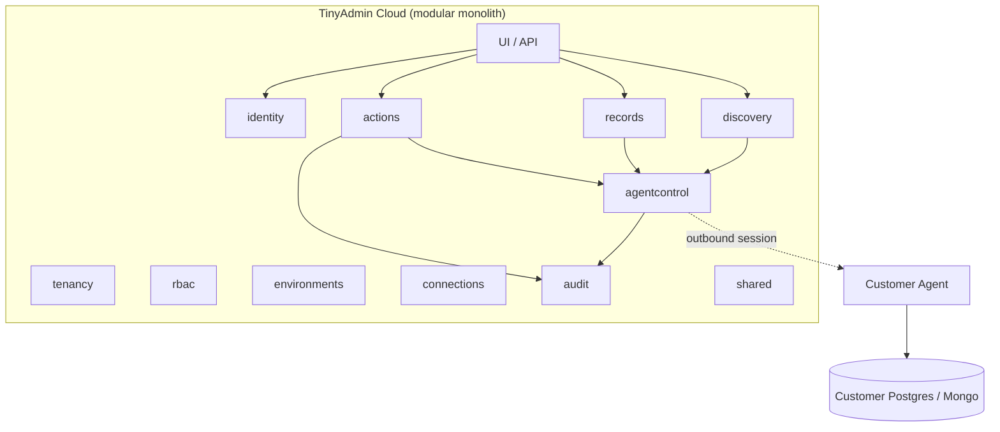
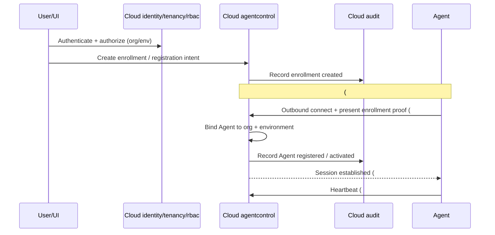
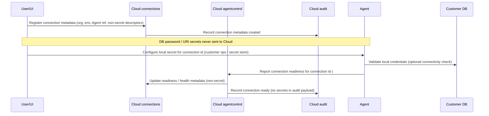
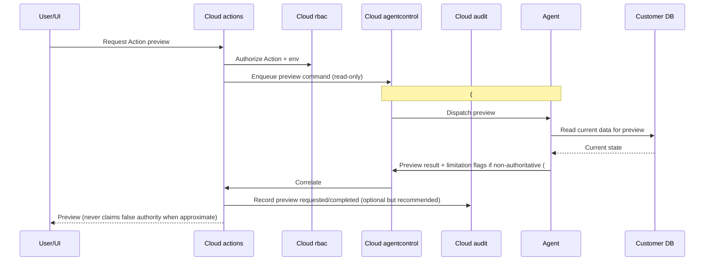
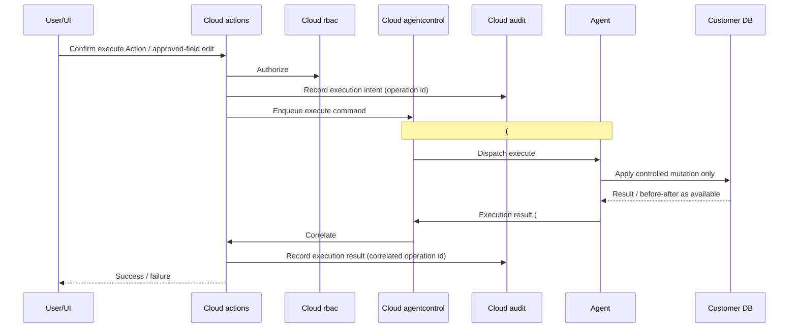

# TinyAdmin V1 System Architecture

**Status:** Proposed for Security + Code Review (Issue #2)  
**Governing issue:** [#2](https://github.com/balarajeai/tinyadmin/issues/2)  
**Product lock:** [docs/product/v1-requirements.md](../product/v1-requirements.md)  
**ADRs:** [adr/](./adr/)  
**Date:** 2026-09-18

This document does **not** claim Security approval. It supplies design inputs for Security (#4/#5) and Code Review.

---

## 1. Summary

TinyAdmin V1 is a **Cloud control plane** (modular monolith) plus a **customer-side Agent** (data plane).

| Principle | V1 stance |
| --- | --- |
| Credentials | Never stored in Cloud; held only by Agent / customer local secrets |
| Connectivity | Agent is **outbound-only** to Cloud |
| Customer DB ports | Cloud never opens connections to customer Postgres/Mongo ports |
| Mutations | Safe Actions + configured approved-field edits only — **no** arbitrary SQL/Mongo |
| Query models | No artificial common query model across PostgreSQL and MongoDB |
| Environments | Meaningful isolation (connections, agents, action context) |
| Audit | Append-oriented; ≥1 year retention design target; ops cannot mutate history |

PostgreSQL is the first customer-DB implementation priority; MongoDB remains in V1 but must not block Postgres-first sequencing.

---

## 2. Control plane vs data plane

### 2.1 Cloud owns (control plane)

- Identity (email/password, invites, sessions, password reset; SSO-ready interfaces later)
- Organizations / tenancy
- RBAC (roles, permissions; **server-side** enforcement)
- Environment registry and environment-scoped context
- Connection **metadata** (which Agent, which environment, non-secret connection descriptors) — **never** DB passwords
- Action definitions and approved-field edit configurations
- Authorization decisions for UI and command issuance
- Audit store
- Agent registry and command orchestration (queue/dispatch/outbox)
- Cached schema/collection metadata that is **non-secret** (sourced from Agent)
- UI / API surface for the above

### 2.2 Agent owns (data plane)

- Customer DB credentials (local secrets only)
- Live DB connections to customer PostgreSQL / MongoDB
- Schema / collection discovery **execution**
- Record search / filter / view **query execution**
- Action preview **reads** (must not mutate)
- Action execute / rollback **mutations**
- Outbound encrypted session to Cloud

### 2.3 Explicit non-ownership

- Cloud **never** opens TCP connections to customer Postgres (5432) or MongoDB (27017) ports (or equivalents).
- Cloud **never** receives or persists customer DB passwords.
- Transport, Agent↔Cloud authentication, and delivery guarantees (at-least-once vs exactly-once) are owned by **Issue #3** — sequences below annotate those touchpoints.

See [ADR 0002](./adr/0002-control-plane-vs-agent-data-plane.md).

---

## 3. Modular monolith module map

Single **Spring Boot** deployable. Modules are packages / bounded contexts, not separate services.

### 3.1 Modules

| Module | Responsibility |
| --- | --- |
| `identity` | Email/password, invites, sessions, password reset; SSO-ready interfaces for later OIDC/SAML |
| `tenancy` | Organizations, memberships |
| `rbac` | Roles/permissions; server-side enforcement helpers used by other modules |
| `environments` | Meaningful prod/staging (and similar) isolation for connections, agents, and action context |
| `connections` | Connection metadata + which Agent/environment; **never** stores DB secrets |
| `agentcontrol` | Agent registration; Agent↔Cloud auth credentials (device/enrollment tokens — details **Issue #3**); heartbeat; command queue/dispatch/outbox |
| `discovery` | Schema/collection metadata ingestion & serving (sourced from Agent) |
| `records` | Search/filter/view orchestration (Agent executes queries) |
| `actions` | Safe Action defs, approved-field edit configs, preview/execute/rollback orchestration |
| `audit` | Append-oriented audit trail; 1-year retention target; ops cannot mutate history |
| `shared` / platform | Cross-cutting tenancy filters, structured logging (**no secrets**), config |

### 3.2 Module dependency rules (normative for V1)

Allowed examples:

- `actions` → `agentcontrol`, `audit`, `rbac`, `tenancy`, `environments`, `connections`, `discovery` (as needed for orchestration)
- `records` → `agentcontrol`, `rbac`, `tenancy`, `environments`, `connections`, `discovery`
- `discovery` → `agentcontrol`, `connections`, `tenancy`, `environments`
- `agentcontrol` → `tenancy`, `environments`, `connections` (metadata), `audit` (for command lifecycle events as required)
- `connections` → `tenancy`, `environments`, `agentcontrol` (association only) — **must not** depend on `actions` or `records`
- `audit` → minimal dependencies; prefer being called by others; no dependency on `actions` implementation details beyond stable event DTOs
- `identity` / `tenancy` / `rbac` → foundational; higher modules depend on them, not the reverse for business features

Forbidden / discouraged:

- `connections` → `actions` (connection registry must not know Action catalog)
- Circular dependencies between `actions` ↔ `discovery` ↔ `records` — prefer orchestration via facades in `shared` only when unavoidable
- Any module importing customer DB drivers or opening customer DB sockets

### 3.3 Microservices rejected for V1

Do **not** split into auth-service, user-service, audit-service, notification-service, agent-service (etc.) in V1.

Reasons:

1. Small team — ops and coordination cost dominate
2. Shared transactional needs for **authorization + audit** on mutations
3. Network/latency and failure-mode cost unjustified at V1 scale
4. Product lock prefers modular monolith unless concrete justification is documented

Extraction later requires a written ADR with evidence. See [ADR 0001](./adr/0001-modular-monolith-cloud.md).



---

## 4. Technology decisions

| Area | Decision | ADR |
| --- | --- | --- |
| Cloud language/runtime | Java 21+ / Spring Boot | [0005](./adr/0005-cloud-stack-java-spring.md) |
| Cloud primary datastore | PostgreSQL | [0003](./adr/0003-cloud-datastore-postgres-redis-deferred.md) |
| Redis | **Deferred** for V1 — use PostgreSQL for sessions / command outbox; revisit for rate-limit / cache scale | [0003](./adr/0003-cloud-datastore-postgres-redis-deferred.md) |
| Agent | **Go** recommended (single binary, low footprint, concurrency, pgx + Mongo driver). Alternatives considered: Node/TS, Java — see ADR | [0004](./adr/0004-agent-technology-go.md) |
| Topology | Modular monolith Cloud + outbound Agent data plane | [0001](./adr/0001-modular-monolith-cloud.md), [0002](./adr/0002-control-plane-vs-agent-data-plane.md) |

---

## 5. High-level sequence flows

Actors: **User/UI**, **Cloud modules**, **Agent**, **Customer DB**.  
Where marked **(#3)**, Issue #3 owns transport, Agent authn, and delivery semantics (at-least-once vs exactly-once, retries, idempotency keys).

### 5.1 Agent registration



### 5.2 Database connection registration

Metadata in Cloud; secrets configured **only** on Agent.



### 5.3 Schema discovery

```mermaid
sequenceDiagram
  participant User as User/UI
  participant Disc as Cloud discovery
  participant AC as Cloud agentcontrol
  participant Agent as Agent
  participant DB as Customer DB
  User->>Disc: Request schema/collection refresh (org/env/connection)
  Disc->>AC: Enqueue discover-schema command
  Note over AC,Agent: (#3) command delivery / ack / retry
  AC->>Agent: Dispatch discover-schema
  Agent->>DB: Introspect schema/collections (driver-native; no artificial common model)
  DB-->>Agent: Metadata
  Agent->>AC: Return non-secret schema metadata (#3)
  AC->>Disc: Persist/cache metadata for UI
  Disc-->>User: Schema/collection view
```

### 5.4 Record search

```mermaid
sequenceDiagram
  participant User as User/UI
  participant Rec as Cloud records
  participant RBAC as Cloud rbac
  participant AC as Cloud agentcontrol
  participant Agent as Agent
  participant DB as Customer DB
  User->>Rec: Search/filter/view request
  Rec->>RBAC: Authorize (org/env/connection/resource)
  Rec->>AC: Enqueue search command (structured; not arbitrary SQL/Mongo)
  Note over AC,Agent: (#3) delivery semantics
  AC->>Agent: Dispatch search
  Agent->>DB: Execute allowed query via driver
  DB-->>Agent: Rows/documents
  Agent->>AC: Return result payload (#3)
  AC->>Rec: Correlate response
  Rec-->>User: Results (tenant-scoped)
```

### 5.5 Action preview (read-only via Agent; never mutates)



### 5.6 Action execution



### 5.7 Audit recording (correlated with every mutation attempt)

```mermaid
sequenceDiagram
  participant Act as Cloud actions
  participant Audit as Cloud audit
  participant Store as Cloud PostgreSQL
  Act->>Audit: Append event (actor, org, env, Action, target, op id, before/after, status, Agent correlation)
  Audit->>Store: Insert append-only row
  Note over Audit,Store: Ops users cannot update/delete history; retention target ≥ 1 year
  Audit-->>Act: Event id
```

Every mutation **attempt** (success, failure, partial, rejected) must produce correlated audit evidence. Rollbacks are separate audited operations linked to the original operation id.

### 5.8 Rollback (only when Action declares reversible + safety checks)

```mermaid
sequenceDiagram
  participant User as User/UI
  participant Act as Cloud actions
  participant RBAC as Cloud rbac
  participant AC as Cloud agentcontrol
  participant Audit as Cloud audit
  participant Agent as Agent
  participant DB as Customer DB
  User->>Act: Request rollback
  Act->>Act: Check Action declares reversible; else unavailable
  Act->>RBAC: Authorize rollback
  Act->>Audit: Record rollback intent (link to original op id)
  Act->>AC: Enqueue rollback command + safety checks
  Note over AC,Agent: (#3) delivery / idempotency
  AC->>Agent: Dispatch rollback
  Agent->>DB: Verify state still safe to reverse; apply reverse mutation or abort
  DB-->>Agent: Outcome
  Agent->>AC: Rollback result (#3)
  AC->>Act: Correlate
  Act->>Audit: Record rollback result
  Act-->>User: Rolled back / unavailable / unsafe
```

If the Action does not declare reversibility, or safety checks fail, UI must **not** present rollback as available.

---

## 6. Trust boundaries (for Security #4/#5)

### 6.1 Boundaries

1. **Internet user ↔ Cloud** — authentication, session security, CSRF/XSS/API abuse, authorization on every sensitive call
2. **Cloud ↔ Agent** — outbound from Agent only; Agent identity/enrollment; encrypted transport; command authenticity and replay (#3)
3. **Agent ↔ customer DB** — local credential handling; least privilege DB roles; connection blast radius
4. **Tenant/org isolation inside Cloud** — every tenant-owned row filtered server-side; cross-tenant access is critical failure
5. **Environment isolation** — prod vs staging (connections, agents, actions context) must not silently cross
6. **Audit integrity / non-repudiation goals** — append-only semantics; retention ≥1 year; who can read/export vs who cannot mutate

### 6.2 What Security must threat-model next

- Agent enrollment token theft / Agent impersonation
- Command injection or privilege escalation via malformed Agent commands
- Replay / duplicate execution under at-least-once delivery (#3)
- Tenant and environment confusion bugs (IDOR, missing filters)
- Audit tampering by privileged ops roles; export/exfiltration of audit contents
- Agent host compromise → multi-connection blast radius
- Preview/execute TOCTOU races and misleading preview authority
- Rollback unsafe reversal and false “safe rollback” UX
- Secret leakage via logs, audit payloads, or error messages (Cloud and Agent)
- Denial of service via command queue growth when Agents are offline

This architecture package is **input** to Security — not Security sign-off.

---

## 7. Risks and tradeoffs

| Risk / tradeoff | Notes |
| --- | --- |
| **Agent offline** | Discovery/search/actions unavailable; commands queue in Cloud; UX must show Agent health |
| **Partial execution** | Multi-step Actions need explicit failure semantics and audit of partial outcomes |
| **Duplicate commands** | (#3) delivery may be at-least-once — idempotency keys and Agent-side dedupe required |
| **Schema drift** | Cached Cloud metadata may lag; refresh flows and stale-schema handling needed |
| **Preview non-authoritative** | Concurrent writes can invalidate preview; UI must not over-claim |
| **Rollback unsafety** | Only when declared reversible + checks pass; otherwise unavailable |
| **Multi-connection Agent blast radius** | One Agent may hold multiple DB credentials — Security must weigh isolation vs ops simplicity |
| **Postgres-first vs Mongo** | No artificial common query model; Mongo sequenced after Postgres proof |
| **Deferred Redis limits** | Sessions/outbox on PostgreSQL may need revisit under rate-limit/cache pressure |

---

## 8. Architecture acceptance criteria (implementers / Code Review)

Implementers and Code Review must satisfy:

- [ ] Customer DB credentials **never** stored, logged, or cached in Cloud
- [ ] Cloud opens **no** connections to customer Postgres/Mongo ports
- [ ] Agent communicates **outbound-only** to Cloud
- [ ] Mutations are **Actions or configured approved-field edits only** — no arbitrary SQL/Mongo from UI or Cloud
- [ ] No artificial common query model forced across PostgreSQL and MongoDB
- [ ] Module boundaries respected per §3 (including `connections` must not depend on `actions`)
- [ ] No premature microservices without a new ADR
- [ ] Tenant (org) filters enforced **server-side** on all tenant-owned resources
- [ ] Environment isolation is meaningful (connections, agents, action context scoped)
- [ ] Preview paths are read-only at the Agent/DB boundary
- [ ] Every mutation attempt is audited with correlation ids; audit is append-oriented; retention design targets ≥1 year
- [ ] Rollback offered only when Action declares reversible and safety checks pass
- [ ] Secrets never appear in structured logs
- [ ] Agent↔Cloud authn/transport/delivery implemented per **Issue #3** ADRs (not invented ad hoc in feature PRs)
- [ ] Redis not introduced without revisiting ADR 0003 criteria

---

## 9. Dependencies / non-goals

### Dependencies (not done here)

| Work | Issue |
| --- | --- |
| Agent↔Cloud protocol, authn, delivery semantics | #3 |
| Domain model | #6 |
| Security threat model / controls | #4 / #5 |

### Non-goals for this document / PR

- Production infrastructure / Contabo provisioning
- Sprint 1 implementation or application feature code
- Full OpenAPI of every endpoint
- Claiming Security approval or closing Issue #2

---

## Document history

| Date | Change |
| --- | --- |
| 2026-09-18 | Initial proposed architecture for Issue #2 |
