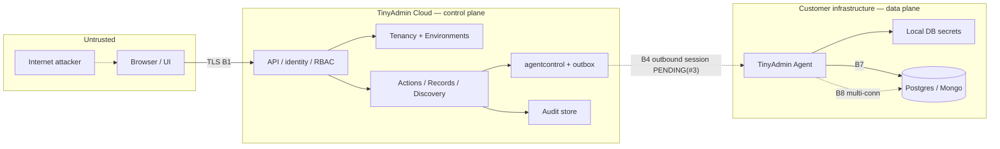

# TinyAdmin V1 Threat Model

**Status:** Formal V1 (Issue #4) — Architect feasibility review + QA testability review required  
**Issue:** [#4](https://github.com/balarajeai/tinyadmin/issues/4)  
**Author role:** Security Engineer  
**Date:** 2026-09-19 (America/Chicago)  
**Architecture input:** MERGED `docs/architecture/v1-system-architecture.md` + ADR 0001–0006 (PR #10 / main)  
**Product lock:** `docs/product/v1-requirements.md` (Founder-approved)  
**Companions:** [threat-register.md](./threat-register.md), [fa-conn-blast.md](./fa-conn-blast.md), [issue-3-security-handoff.md](./issue-3-security-handoff.md), [implementation-handoffs.md](./implementation-handoffs.md)  
**Issue #5 companion (draft):** [v1-security-requirements.md](./v1-security-requirements.md) — still pending Architect/QA gates

This model is adversarial design input for implementers and reviewers. It does **not** approve implementation, production deploy, Issue #3 protocol selection, or claim TinyAdmin is secure. Unresolved CRITICAL/HIGH threats require a required security control (SR/TM) **or** an explicit Founder risk-acceptance placeholder (FA-*). Agents MUST NOT invent Founder acceptance.

---

## 1. Purpose

Produce an actionable V1 threat model so Architect and implementers cannot skip security-critical design for Cloud, Agent, Safe Actions / approved-field edits, preview/confirm/execute/rollback, audit, tenancy, environments, and Agent↔Cloud trust properties.

## 2. Scope

### 2.1 In scope (V1)

| Surface | Notes |
| --- | --- |
| TinyAdmin Cloud | Modular monolith control plane (identity, tenancy, RBAC, environments, connections metadata, agentcontrol, discovery, records, actions, audit) |
| Customer Agent | Enrollment, identity, outbound session, command handling, local DB credentials |
| Enrollment / channel | Enrollment proofs, Agent↔Cloud control channel (**mechanism PENDING Issue #3**; properties required) |
| Org / env | Multi-tenant organizations; meaningful prod/staging isolation |
| Connections | Connection metadata in Cloud; secrets only on Agent; multi-connection Agent topology |
| PostgreSQL / MongoDB | Customer DB access via Agent only; Postgres-first sequencing |
| Discovery / search | Schema/collection discovery; structured search/filter/view |
| Approved-field edits | Explicitly configured allowlists only |
| Safe Actions | Define → authorize → preview → confirm → execute → audit → optional rollback |
| Preview / confirm / execute | Read-only preview; Cloud confirm gate; mutating execute with §3.5 bindings |
| Authz bindings / op IDs | Cloud-issued operation authorization bindings; stable `operation_id` lifecycle |
| Results / reconciliation | Durable Agent results; pending/succeeded/failed/unknown; no silent terminalization |
| Audit | Append-oriented + storage-level immutability; ≥1 year retention target |
| Rollback | Only when declared reversible + safety checks |
| User auth | Email/password, sessions, invites, password reset |
| RBAC | Server-side; define vs run separation |
| Tenant isolation | Cross-tenant access = CRITICAL |

### 2.2 Non-goals

- Full penetration test / production probing
- Production / Contabo hardening checklist execution
- Implementing application code or fixes
- Selecting Agent↔Cloud protocol mechanism (Issue #3 — Architect)
- Billing / payments / SSO-SAML as V1 auth path
- AI-generated mutations
- Claiming whole-system Security PASS or closing Issue #2/#3/#5

### 2.3 Methodology

- **STRIDE-informed** enumeration across trust boundaries (practical, not ceremony)
- **Abuse cases** shaped to product flows (Actions, preview, rollback, Agent offline)
- **OWASP Top 10 / API Top 10** as failure checklists (not certification claims)
- Explicit separation of **EXISTING ARCHITECTURE CONTROL** (cite § / ADR) vs **REQUIRED SECURITY CONTROL** (SR/TM for Issue #5 and implementers)
- Mechanism-unknown items marked **PENDING(#3)** with required properties from ADR 0006 / architecture §2.4

---

## 3. Assets

| ID | Asset | Sensitivity | Location |
| --- | --- | --- | --- |
| A1 | Customer DB credentials | CRITICAL | Customer infra / Agent local secrets only — **never Cloud** |
| A2 | Customer business data (PII, financial, operational) | HIGH–CRITICAL | Customer DB; transient on Agent/Cloud response path |
| A3 | TinyAdmin user passwords / reset tokens | HIGH | Cloud `identity` |
| A4 | User sessions / session tokens | HIGH | Cloud PostgreSQL (ADR 0003); browser |
| A5 | Agent enrollment secrets / long-lived Agent credentials | CRITICAL | Cloud `agentcontrol` + Agent local store |
| A6 | Agent identity binding (org, env, agent_id) | CRITICAL | Cloud registry; Agent local binding |
| A7 | Action definitions & approved-field configs | HIGH | Cloud `actions` |
| A8 | RBAC roles / permissions / define-vs-run | HIGH | Cloud `rbac` |
| A9 | Command queue / outbox | HIGH | Cloud PostgreSQL |
| A10 | Operation authorization bindings / tickets | CRITICAL | Issued by Cloud; validated by Agent; encoding PENDING(#3) |
| A11 | Operation results & lifecycle (`operation_id`) | HIGH | Agent durable store + Cloud actions |
| A12 | Audit history | HIGH | Cloud `audit` — integrity + confidentiality |
| A13 | Cached schema/collection metadata (non-secret) | MEDIUM | Cloud `discovery` |
| A14 | Connection metadata (non-secret) | MEDIUM–HIGH | Cloud `connections` |
| A15 | Organization / membership / environment registry | HIGH | Cloud `tenancy`, `environments` |

---

## 4. Actors

| ID | Actor | Trust | Notes |
| --- | --- | --- | --- |
| U1 | Anonymous internet user | Untrusted | Public auth endpoints |
| U2 | Support / ops / CS user | Low–medium | Must never receive DB creds or arbitrary SQL/Mongo |
| U3 | Tenant admin | Medium | Invites, configure Agents/connections/Actions (RBAC-gated) |
| U4 | TinyAdmin platform operator | Medium–high | No customer DB creds; cannot mutate audit history |
| AT1 | Attacker with stolen SaaS session | Hostile | Session theft / XSS-assisted |
| AT2 | Cross-tenant attacker (valid Org A user) | Hostile | BOLA/IDOR against Org B |
| AT3 | Compromised / malicious Agent host | Hostile | May hold multiple DB credentials (FA-CONN-BLAST) |
| AT4 | Network MITM | Hostile | Browser↔Cloud or Agent↔Cloud |
| AT5 | Malicious insider with Cloud DB access | Hostile | Direct datastore access |
| AT6 | Attacker with stolen enrollment proof | Hostile | Agent impersonation window |
| S1 | Cloud modules | Partially trusted | “Internal” ≠ authenticated across planes |
| S2 | Agent process | Partially trusted | Authenticated to Cloud; must not invent authz |

---

## 5. Trust-boundary analysis

### 5.1 Boundary table

| ID | Boundary | Description |
| --- | --- | --- |
| B1 | User/browser ↔ Cloud | Untrusted client; authn + server-side authz + tenant/env on every sensitive call |
| B2 | Cloud tenant (org) isolation | Org A unreachable from Org B; client `organizationId` never authorization |
| B3 | Production ↔ staging (environment) | Agents, connections, command context must not silently cross (§3.4) |
| B4 | Cloud ↔ Agent channel | Outbound-only; encrypted; authenticated Agent identity; cmd authenticity + replay — **PENDING(#3)** mechanisms |
| B5 | Agent enrollment | Short-lived enrollment → long-lived Agent credential bound to org+env |
| B6 | Agent identity | V1: exactly one org + one env at activation |
| B7 | Agent ↔ customer DB | Local credentials; least-privilege DB roles |
| B8 | Multi-connection Agent | Connection confusion + credential blast radius |
| B9 | Safe Action / field-edit lifecycle | Define → run → preview → confirm → execute → audit → rollback |
| B10 | Authorization binding | Cloud-issued §3.5 ticket validated by Agent before mutation |
| B11 | Audit integrity | Storage-level append-only; ops cannot mutate/delete |
| B12 | Offline command queues | Stale/revoked/dangerous command risk while Agent offline |

### 5.2 Diagram (architecture-aligned)

Architecture references: §6.1–6.2, ADR 0002, ADR 0006.

---

## 6. Abuse cases (product-shaped)

| ID | Abuse case |
| --- | --- |
| X1 | Support user in Org A reads/mutates Org B (tenant escape / BOLA) |
| X2 | Staging Action executed against production connection |
| X3 | Arbitrary SQL/Mongo via crafted search or Action parameters |
| X4 | Mass mutation / unbounded fan-out Action |
| X5 | Preview leaks sensitive rows to unauthorized role |
| X6 | Misleading preview then execute against changed state (TOCTOU) |
| X7 | Rollback presented when unsafe; or rollback without authz/audit |
| X8 | Stolen enrollment → attacker Agent joins customer org |
| X9 | Replay execute → duplicate mutation |
| X10 | Compromised Agent as confused deputy / wrong connection |
| X11 | Ops deletes/edits audit to hide misuse |
| X12 | Offline queue drains stale mutating command after revoke |
| X13 | Approved-field config widened into near-generic DB editor |
| X14 | Secrets appear in logs/audit/errors |
| X15 | Lost Agent result → Cloud falsely marks success/failure |
| X16 | SSRF via connection descriptors or Agent-reachable URLs (if any) |
| X17 | XSS/CSRF leading to privileged Action execute |

---

## 7. Surface analysis (summary)

Detailed threats are in [threat-register.md](./threat-register.md). Narrative highlights:

### 7.1 Cloud (control plane)

- Server-side tenant/env/RBAC on every sensitive API (architecture §2.1, §3.6, §6.1, §8).
- Never store/log customer DB credentials; never open customer DB ports (§2.3).
- Explicit confirm gate before minting §3.5 mutating bindings (§5.6, CR-PR10-004).
- Operation lifecycle honesty (§5.6.1).

### 7.2 Agent (data plane)

- Holds credentials; executes discovery/search/preview/execute/rollback.
- MUST reject authenticity/integrity/freshness/org/env/agent/connection/Action mismatches (§2.2, §3.4–3.5).
- Durable results until Cloud ack (§5.6.1).

### 7.3 Enrollment & channel — PENDING(#3)

Required properties (ADR 0006 / §2.4): **P-OUTBOUND, P-ENCRYPT, P-AGENT-ID, P-CMD-AUTH, P-REPLAY, P-ORG-BIND, P-ENV-BIND**. Security does **not** select mTLS vs JWT vs other here. See [issue-3-security-handoff.md](./issue-3-security-handoff.md).

### 7.4 Org / env / connections

- Normative isolation §3.4: Agent one org+one env; immutable connection org/env; Agent rejects mismatch; no silent staging↔prod cross.
- Connection_id verified on sensitive commands (SEC-PR10-010).
- Multi-connection blast radius: compensating controls + [fa-conn-blast.md](./fa-conn-blast.md) — **not silently accepted**.

### 7.5 Discovery / search / approved-field / Safe Actions

- Structured commands only — no arbitrary SQL/Mongo (Founder + §1, §8).
- Parameterized driver APIs; Action/field allowlists; define≠run (§3.6).
- Blast-radius bounds on fan-out mutations.

### 7.6 Preview / confirm / execute / op IDs / results

- Preview never mutates; honest limitation flags (§5.5–5.6).
- Confirm before binding mint; execute-time revalidation or safe preview bind.
- Idempotency / replay resistance; durable results; no silent terminalization.

### 7.7 Audit / rollback

- Every mutation attempt audited with `operation_id`; storage-level immutability (§5.7, SEC-PR10-006).
- Rollback only when declared reversible + safety checks; authorized + audited (§5.8).

### 7.8 User auth / sessions / invites / reset / RBAC / tenant isolation

- Email/password, invites, reset, sessions in product scope (§4 product lock).
- CSRF/XSS/session controls required.
- Cross-tenant = CRITICAL.

---

## 8. Mapping to architecture controls

| Theme | Existing architecture control | Required security control (SR/TM) |
| --- | --- | --- |
| No Cloud DB creds / outbound Agent | §1, §2.3, ADR 0002, §8 AC | SR-SECRET-CLOUD-DENY, SR-XPORT-OUTBOUND |
| Cloud↔Agent properties | §2.4, ADR 0006 | SR-XPORT-*, SR-AGENT-*, PENDING(#3) mechanism |
| Env isolation | §3.4, sequences 5.1–5.2 | SR-ENV-* |
| Authz binding / confused deputy | §3.5, §5.6, §5.8 | SR-CMD-TICKET / SR-CMD-AUTH |
| Define vs run | §3.6 | SR-RBAC-ACT-* |
| Preview honesty / TOCTOU | §5.5–5.6 | SR-PREV-* |
| Confirm gate | §5.6 CR-PR10-004 | SR-CONF-* |
| Result durability | §5.6.1 | SR-OP-*, SR-IDEM-* (wire PENDING(#3)) |
| Audit immutability | §5.7 | SR-AUDIT-* |
| Rollback honesty | §5.8 | SR-RB-* |
| Offline queue | §5.9 | SR-QUEUE-* |
| Multi-conn blast | §7 FA-CONN-BLAST placeholder + compensating controls | SR-CONN-BLAST, FA-CONN-BLAST formal disposition |
| Tenant / client org id | §6.1 #1, §8 SEC-PR10-007 | SR-TEN-* |

---

## 9. Security gates for implementation epics

| Gate ID | Applies to | Requirement |
| --- | --- | --- |
| SG-1 | Authn / session / invite / reset | Security review + tests for SR-AUTH/SESS/INV/RESET |
| SG-2 | Tenant-scoped API / query | Automated cross-org deny tests; Security on first introduction |
| SG-3 | Env-scoped Agents/connections/Actions | Prod≠staging tests; visual/operational distinction evidence |
| SG-4 | Agent enrollment / transport (#3 impl) | Security review vs ADR 0006 + this TM; no ad-hoc feature-PR invention |
| SG-5 | Execute / rollback paths | Binding validation, idempotency, replay, lifecycle honesty tests |
| SG-6 | Preview paths | Non-mutating proof; honesty flags; confirm gate |
| SG-7 | Action / approved-field definition | Define≠run; allowlist enforcement; blast bounds |
| SG-8 | Audit module | Storage-level append-only; ops-deny mutate; retention design |
| SG-9 | Logging / errors | Secret redaction tests |
| SG-10 | Agent DB access | No Cloud credential storage; parameterized queries only |
| SG-11 | Offline queue | TTL/depth + cancel-on-revoke tests |
| SG-12 | FA-CONN-BLAST controls | Compensating controls evidence or recorded Founder acceptance |

Unresolved HIGH/CRITICAL on these epics **block release** unless human exception under AI_AGENT_POLICY.

---

## 10. Residual risk summary + Founder acceptance placeholders

| ID | Risk | Sev | Disposition |
| --- | --- | --- | --- |
| R1 | Agent host compromise ⇒ all local DB credentials for configured connections | HIGH | Compensating controls required; residual → **FA-CONN-BLAST** ([fa-conn-blast.md](./fa-conn-blast.md)) — **not silently accepted** |
| R2 | Email account compromise ⇒ invite/reset abuse | MEDIUM | TTL, single-use, rate limits; V1 awareness — no FA required |
| R3 | Residual preview/execute race after mandatory revalidation | MEDIUM | Honest flags mandatory; optional **FA-PREV-RACE** only after controls exist |
| R4 | Malicious insider with Cloud PostgreSQL superuser | HIGH | Infra/ops controls (later); app-level audit immutability still required |
| R5 | Issue #3 protocol not yet selected | HIGH | **Not a waiver** — PENDING(#3); Security re-reviews #3 against this TM + ADR 0006 |
| R6 | Customer DB role too powerful despite guidance | HIGH | SR-DB-LEAST + customer runbook; residual customer-ops responsibility |

### FA placeholders (human completion only)

**FA-CONN-BLAST** — see dedicated [fa-conn-blast.md](./fa-conn-blast.md).  
- Accepting human: _TBD_  
- Date: _TBD_  
- Reason: _TBD_  
- Expiry / follow-up: _TBD_

**FA-PREV-RACE** (optional) — only after execute-time revalidation / preview-bind controls ship.  
- Accepting human: _TBD_ — Date: _TBD_ — Reason: _TBD_ — Follow-up: _TBD_

---

## 11. Explicit Issue #3 pending list

Security does **not** select Agent↔Cloud protocol. The following are **PENDING(#3)** with mandatory properties:

| Pending item | Required properties / constraints |
| --- | --- |
| Transport / handshake / framing | P-OUTBOUND, P-ENCRYPT |
| Agent authentication credential format | P-AGENT-ID (org-wide static secret alone insufficient) |
| Command authenticity / integrity encoding | P-CMD-AUTH |
| Replay resistance mechanism (nonce/jti/seq/expiry) | P-REPLAY; silent re-mutation forbidden |
| Org/env binding encoding on session & commands | P-ORG-BIND, P-ENV-BIND; Agent reject duties |
| §3.5 authorization binding wire encoding | Minimum fields in architecture §3.5 |
| At-least-once vs exactly-once / idempotency keys | Must support SR-IDEM / no silent duplicate mutation |
| Result delivery / ack / reconciliation wire | §5.6.1 properties mandatory |
| Enrollment proof format / TTL mechanics | Short-lived, single-use, org+env pre-bind (SR-ENROLL-*) |
| Offline queue delivery semantics | TTL/depth/cancel-on-revoke control points exist (§5.9) |

Conformance checklist: [issue-3-security-handoff.md](./issue-3-security-handoff.md).

---

## 12. References

| Artifact | Role |
| --- | --- |
| [threat-register.md](./threat-register.md) | Actionable threat register (TM-*) |
| [fa-conn-blast.md](./fa-conn-blast.md) | Formal FA-CONN-BLAST disposition |
| [issue-3-security-handoff.md](./issue-3-security-handoff.md) | Security properties #3 must satisfy |
| [implementation-handoffs.md](./implementation-handoffs.md) | Backend / Agent / Frontend / QA / Platform requirements |
| [v1-security-requirements.md](./v1-security-requirements.md) | Issue #5 companion SHALL list (draft) |
| [reviews/pr-10-architecture-security-review.md](./reviews/pr-10-architecture-security-review.md) | Historical PR #10 Security review |
| [reviews/issue-4-threat-model-status.md](./reviews/issue-4-threat-model-status.md) | Issue #4 status vs prior draft |
| Architecture §2.4, §3.4–3.6, §5.5–5.9, §6–8; ADR 0002; ADR 0006 | Normative architecture controls |
| Product `v1-requirements.md` | Founder hard constraints |

---

## 13. Document history

| Date | Change |
| --- | --- |
| 2026-09-18 | Initial Security draft (PR #11) |
| 2026-09-19 | Formal V1 Issue #4: reconcile MERGED architecture + ADR 0006; extract register/FA/#3/impl handoffs; supersede prior draft narrative |
